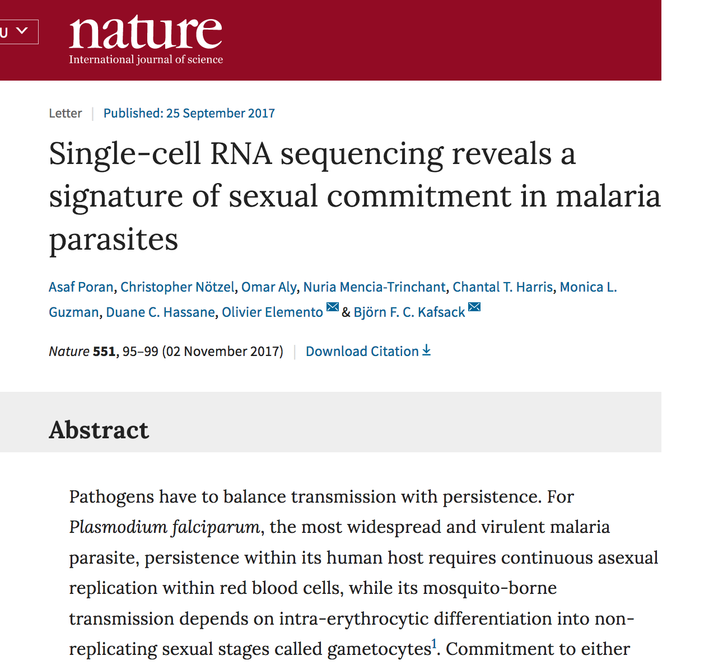
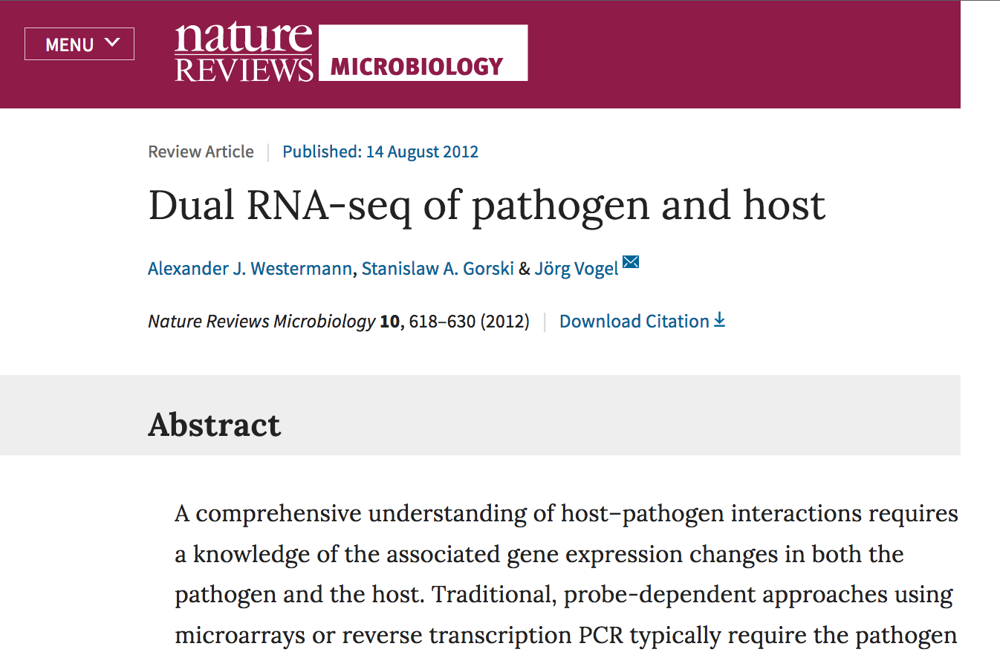
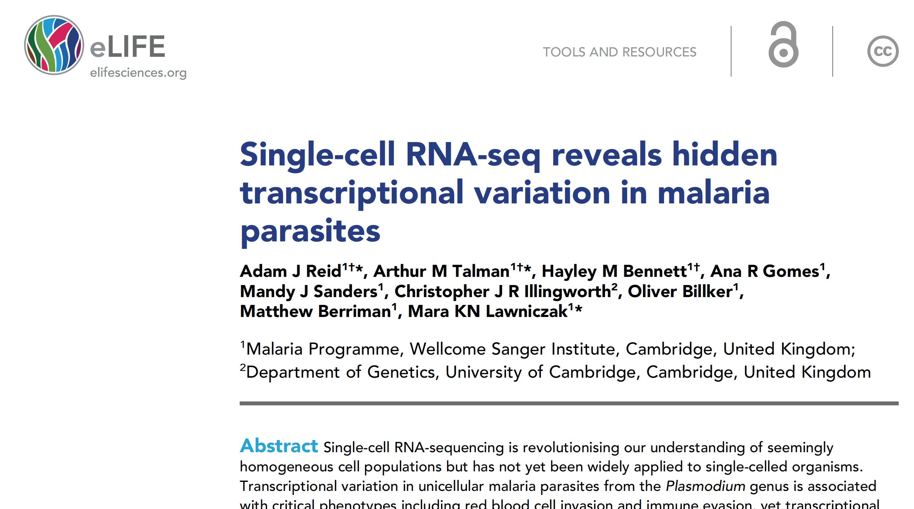
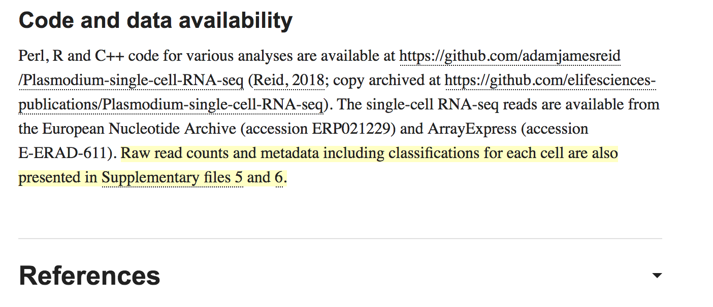

## What do you need to analyse [single-cell omics] data?

You need

> - `Domain specific knowledege` (biological field) +
> - `Data analysis mindset` (abstraction, working with numbers) + 
> - `Knowledge of tools` (process data files, visualise, conclude)

*You need to understand the concepts to ask the right questions.*

## Focus of the course

> 1. Learn **concepts of high-throughput data analysis**, instead of coding syntax.
> 2. **Develop abstract thinking to find the common core in various problems**.
> 3. Analyse publicly available **single-cell transcriptomic** datasets to practice some of the skills.

## Concepts of high-throughput data analysis

> - Learn **concepts of high-throughput data analysis**, instead of coding syntax
>   - While syntax of base-R is stable, the syntax of R-packages or, BioInfo software is not
>     - They expire in 2-3 years
>   - Consequence: 
>     - We gonna learn a lot of machine learning concepts.
>     - There is gonna be limited amount of coding.
>     - Exceptions: 
>       - Basic coding in bash, using the linux terminal.

## Develop abstract thinking to solve various problems

> - Throughout the entire course we transform biological problems into numeric problems.
>    - With this, we can find concepts how to generally solve them
>    - Although we essentially do math, we can explain these in plain words, so you won’t be burdened with a lot of equations.
>  - This will allow you take one step back, and think on a higher level in whatever domain you will be.

## Single-cell transcriptomics is booming, and its going to reach you

***What is so special about single-cell mRNA-sequencing,***
 ***that it worth your time?***

>  - This is the most widespread method to date
>  - Consequence: 
>    - **You have access to a lot of data**, that you can use it for yourself.
>    - The method will become available to you soon.
>  - We will have an outlook to other x-omics fields

## Field is booming and it reaches the parasitology field

 {width=700px}

## You can now mearure host-pathogen interaction in the same cell!

- Parasite - host-cell / virus - host-cell
- How do transcriptional changes in the parasite affect the host cell?

 {width=700px}

## Heterogeneity of individual parasites may be a key feature 

How does heterogeneity: 

- Help to overcome the immune system (arms race)?
- How does it arise, and 
- How is it controlled?

  {width=700px}

## Access to publicly available single-cell transcriptomics dataset

They are typically required to share the data. If lucky, they provide:
- a gene expression matrix (`.xlsx`), 
  or you have to download the
- raw data (`.fastq` files )

  {width=700px}

## We are standing on the shoulders of *anonym* giants

**A Disclaimer**

This course material is based on hundreds of sources published on the web. Referencing each half sentence and graph was a task beyond my capacities, hereby I thank all authors making their work publicly available, and apologise to unnamed authors. Consequently, I would not like take credit for this course is "my achievement” or  "my original work”. I only hope that it will be useful for learning.

---
### Some notable sources:

- Kolodziejczyk, Aleksandra A., Jong Kyoung Kim, Valentine Svensson,  John C. Marioni, and Sarah A. Teichmann. 2015. “The Technology and  Biology of Single-Cell RNA Sequencing.” *Molecular Cell- 58 (4). Elsevier BV: 610–20. doi:[10.1016/j.molcel.2015.04.005](https://doi.org/10.1016/j.molcel.2015.04.005).
- https://github.com/hemberg-lab/scRNA.seq.course/
- Korflab UNIX course

## Overview - Approximate schedule

1. Next generation sequencing 
2. History & Concepts in sc-seq
3. scRNA-seq Experiments
4. Analysis of scRNA-seq data
   1. Data
      1. *Unix intro (P)*
   2. Analysis pipeline
   3. File formats
   4. Tools & software
5. *Example dataset analysis with Seurat (P)* 
   1. Machine learning concepts
6. (Novel & experimental data analysis)

## Data analysis is part of the experiment - it’s not something for later

> *To consult the statistician after an experiment is finished is often  merely to ask him to conduct a post mortem examination. He can perhaps  say what the experiment died of.”* 
>
> R.A. Fisher, 1938

*Your first take home message.*  

