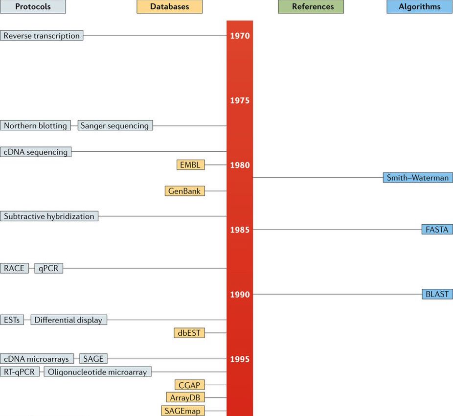
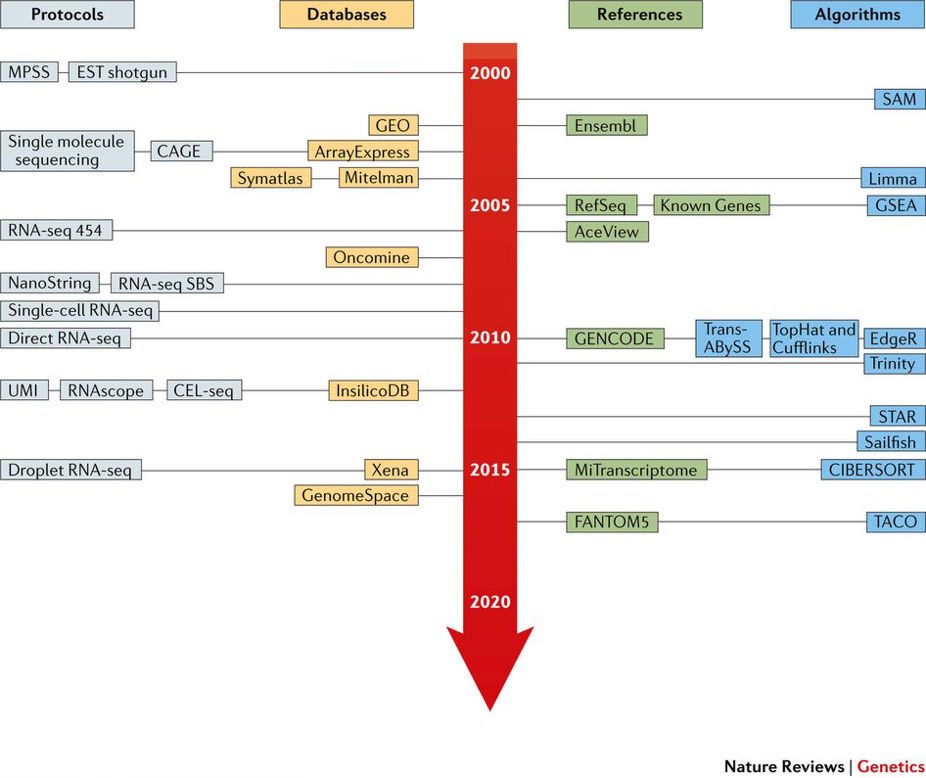
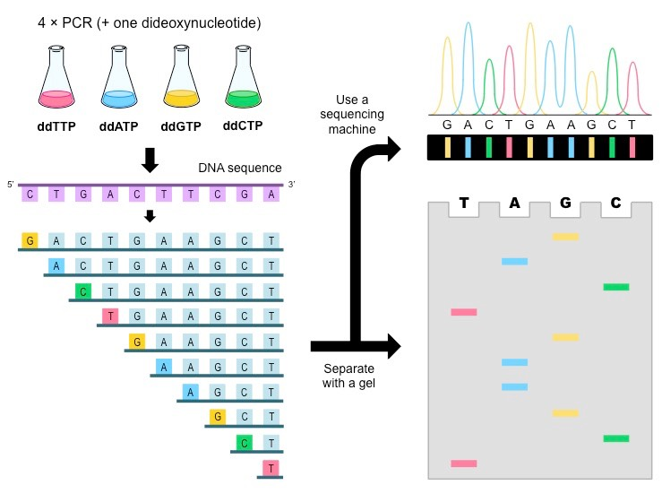
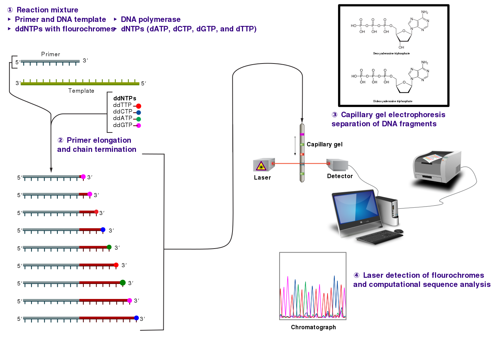
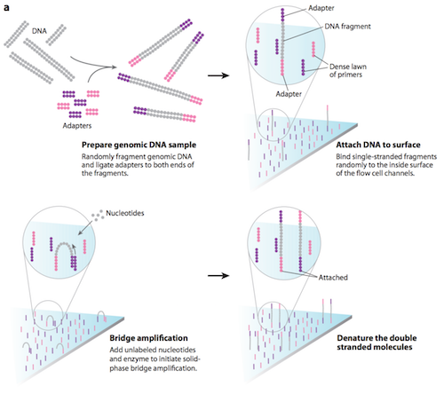
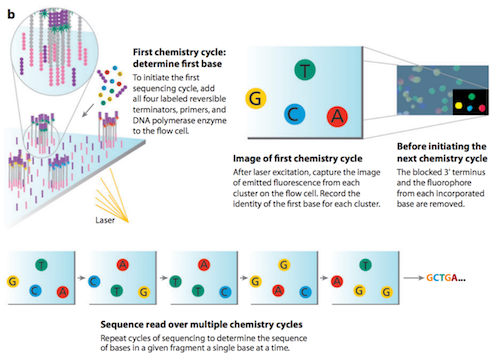
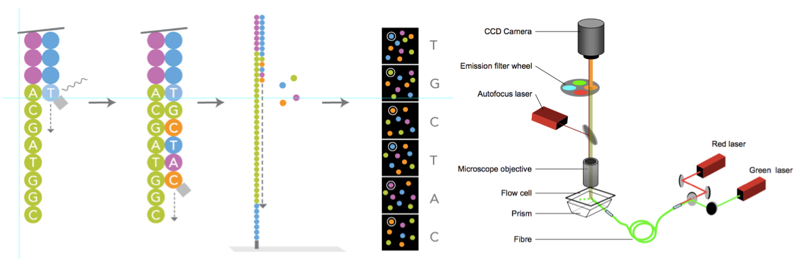
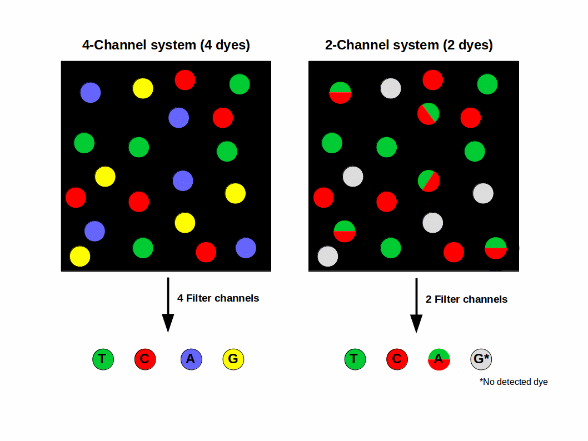
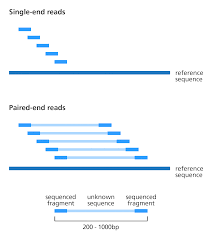

## History of DNA/RNA sequencing

## Sanger sequencing is developed in the late '70s

{width=700px}
> Source: Cieślik - 2018

## RNA-seq emerged shortly after NGS from 2005

{width=700px}

> Source: Cieślik - 2018
> Also see: [rna-seqblog.com](https://www.rna-seqblog.com/a-brief-history-of-rna-seq/)

## Sanger sequencing

*A.k.a: Capillary sequencing or first-generation sequencing*

- the first sequencing method still used
- uses labeled terminating codons 
- Separation by electrophoresis / chromatography (~sep by length)
- Readout in chromatogram

## Principle of Sanger sequencing

{width=700px}

## The whole setup to date

{width=700px}

> Wikipedia

## Next generation sequencing

Different NGS platforms / configurations and sequencing chemistry. 

- Illumina
- PAC-bio
- Ion-torrent
- *New comer: Nano-pore (very different)*

##### Shared properties 

- massive parallel sequencing
- spatially separated, clonally amplified DNA molecules

## Illumina Sequencing

## Amplification on the flow cell by bridge PCR

{width=500px}

Source: https://wiki.mcmaster.ca/

## Sequencing of clones (local clusters) by adding coloured nucleotides

{width=500px}

> Source: https://wiki.mcmaster.ca/

## Sequencing by synthesis

- Adding four fluorescently-labelled  reversible terminator nucleotides, primers, and DNA polymerase to the  flow cell. 
- The primer attaches to the illumina adapter of the DNA being sequenced. 
- The DNA  polymerase then binds to the primer and adds the first fluorescently-labelled terminator nucleotide (base) to the new DNA  strand. 
- The coloured terminator nucleotides stops it
  - All strands arrive to the same point in sequence with the 
- Microscopy (colour dots)
- Cleave terminating residue 
- Repeat 

## Sequencing by synthesis - Overview

{width=700px}

## Newer sequencers use only two colours to cut down the cost

{width=700px}

## Single & paired-end sequencing

Source: [Devon Ryan](https://www.biostars.org/p/267167/)

## sc-Seq uses paired-end sequencing

- Most scRNASeq protocols are sequenced with paired-end sequencing. 
- Barcode sequences may occur in one or both reads depending on the protocol employed. 
- Typically: one read with the **CBC** and **UMI** , other read for transcript sequence (used for mapping).
- Reads will be mapped as if they are single-end sequenced despite actually being paired end.

