## Disclaimer

This course material was heavily based on multiple sources:

- Kolodziejczyk, Aleksandra A., Jong Kyoung Kim, Valentine Svensson,  John C. Marioni, and Sarah A. Teichmann. 2015. “The Technology and  Biology of Single-Cell RNA Sequencing.” *Molecular Cell- 58 (4). Elsevier BV: 610–20. doi:[10.1016/j.molcel.2015.04.005](https://doi.org/10.1016/j.molcel.2015.04.005).
- https://github.com/hemberg-lab/scRNA.seq.course/
- Most figures are captured from the web & my apologies (to the authors) for missing references

# History

## Bulk RNA-seq

> - Replaced microarrays in the late 00's and has been widely used since
> - __Average expression level__ for 1000's of genes
> -  Useful for:
>    - Compare tissues
>    - Compare disease / healthy
> - __Insufficient__ for studying
>    - heterogeneous systems
>        - early development
>        - complex tissues (brain)
>    - Stochastic gene expression

## scRNA-seq

> - A __new__ technology, first publication by Tang 2009
> - Widespread from [~2014](https://www.ohio.edu/bioinformatics/upload/Single-Cell-RNA-seq-Method-of-the-Year-2013.pdf): new protocols and lower sequencing costs
> - Measures the __distribution of expression levels__ for each gene

## scRNA-seq evolution

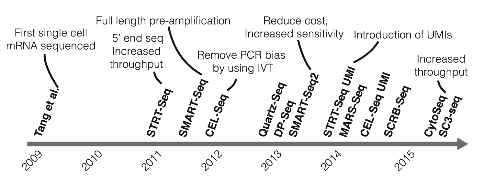

# Concepts

## scRNA-seq allows to study new biological questions

> - Cell type identification
> - Heterogeneity of response
> - Stochasticity of gene expression
> - Reconstructing continous processeses from a single experiment
> - Holistic view, hypothesis-free science
>   - Datasets range __from $10^2$ to $10^6$ cells__ and increase in size every year
>   - Not testing a concrete hypothesis
> - Hypothesis-driven and data-driven science
>   - **Heard about it? Could you explain?**

## Hypothesis-driven and data-driven science

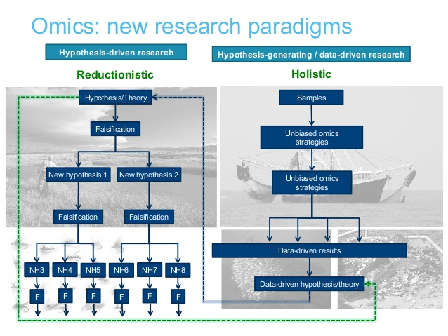

# Experimental Strategies

## Basic Workflow

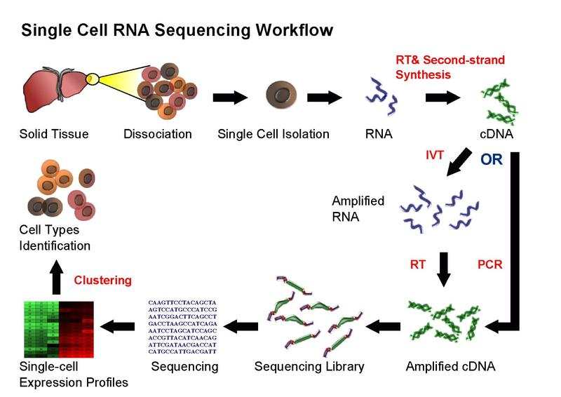

>  from Wikipedia

## Cell capture

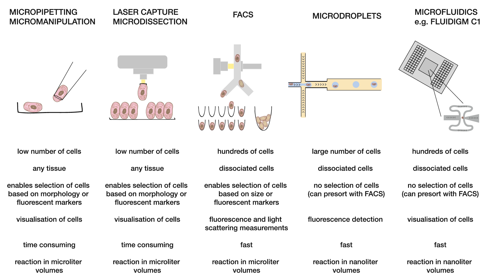

## Manual isolation by mouth pipet

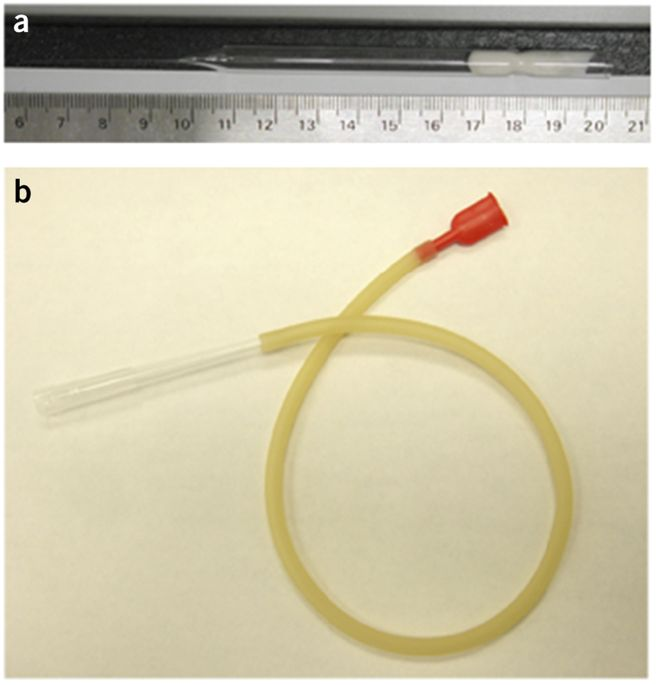

## Laser capture micro-dissection (LCM) into eppendorf tubes

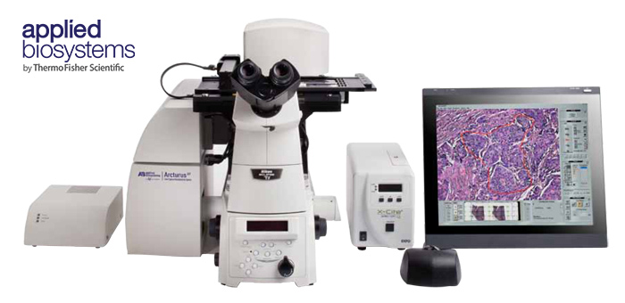

## FACS sorting into microwell plates

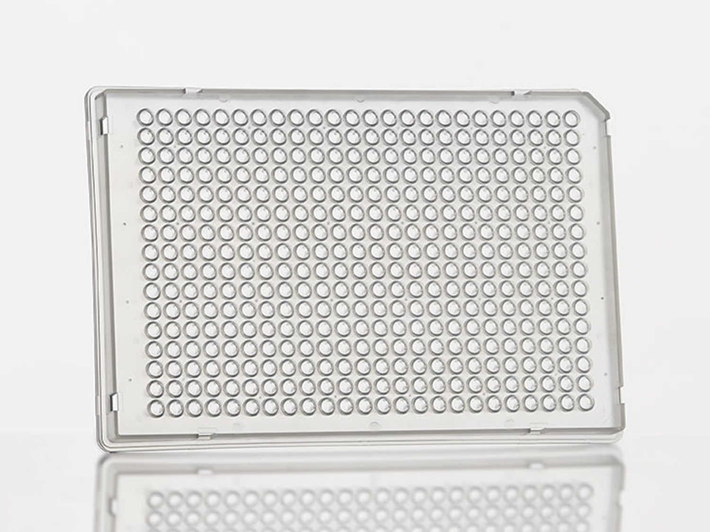 {width=600px}

## Isolation by FACS machine

> - Fluorescence activated cell sorting
> - You can select a subset of cells:
>   - Size of blood cells
>   - Dazl-GFP mouse line to select germ cells

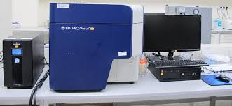

## FACS concept

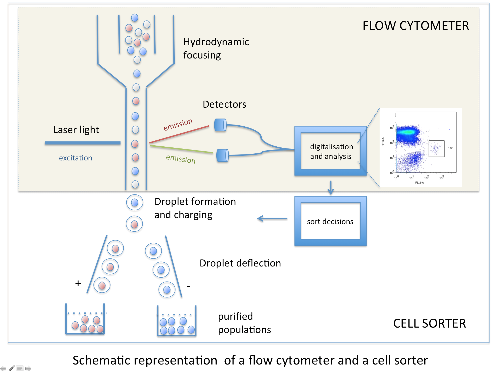

## Isolation by microfluidics & preparation insider droplets

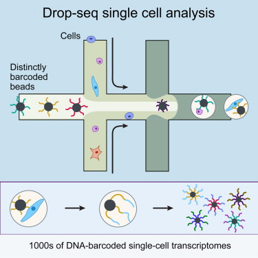
> Macosko 2015

## Picowell

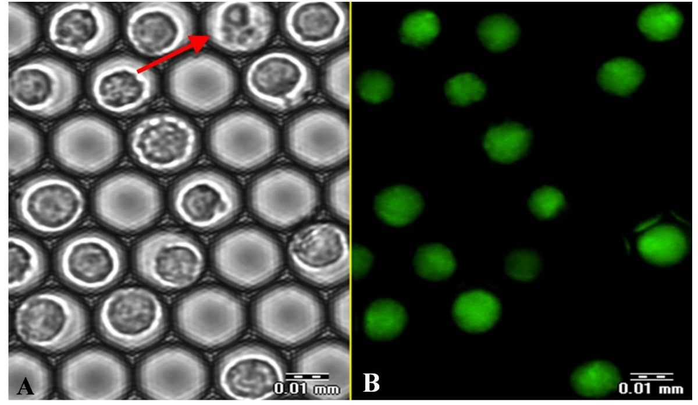

## Picocells allow simple sedimentation instead of FACS

> - Too small for FACS
> - Volume per well is so low, that even at 10% loading, you waste very little reagents

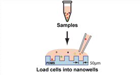

## Platforms & scaling

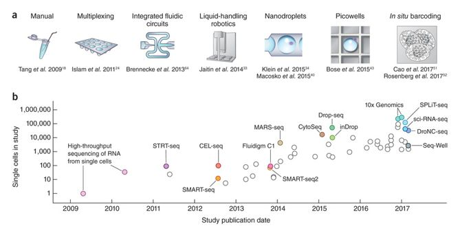

> Source: Svensson 2018

## RNA amplification strategies

> - Full length
> - 3’ *(aka: 3 prime)*
> - 5’ *(aka: 5 prime)*

## RNA structure 

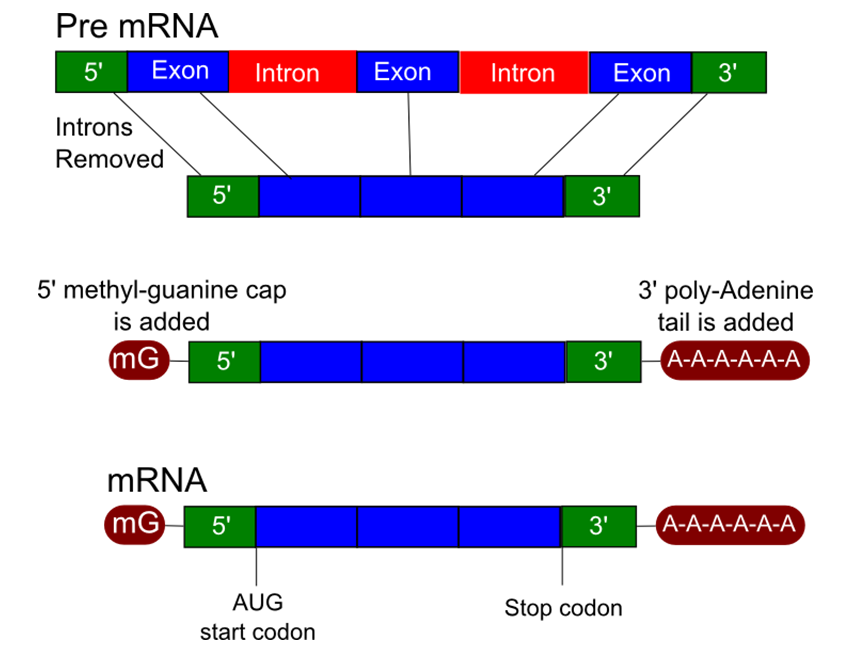

Expressed sequence tag counting (`EST`)

## Different Coverage along the transcript (Full L. vs. 3')

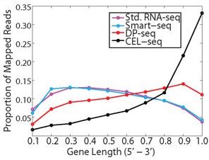

>  Bhargava 2014

## Full length

> - Advantage?
>   - Isoform specificity
>   - Higher sensitivity
> - SMART-seq2 [@Picelli2013-sb]

##  3’

> - Sufficient for transcript counting
> - Advantage?
>   - A lot cheaper
> - 3’ alternative polyadenylation
>   - One kind of isoforms
> - CEL-seq (Hashimshony 2012)
> - Drop-seq (Macosko 2015)
> - Almost all novel methods

## 5'

> - Sufficient for transcript counting & cheap
> - 5’: [Alternative transcription start site ](https://www.ncbi.nlm.nih.gov/pmc/articles/PMC3504680/)
> - STRT-seq (Islam et al.)

# Experimental Procedures in detail

## Steps in single-cell mRNA sequencing

## Problems

> - RNA is unstable ← → RNAse enzymes are very robust
>   - Convert it to cDNA immediately
> - Very low RNA input material → Huge amplification
> - Huge amplification → Amplification bias ("PCR artefact")

## Reverse transcriptase

A **reverse transcriptase** (RT) is an [enzyme](https://en.wikipedia.org/wiki/Enzyme) used to generate [complementary DNA](https://en.wikipedia.org/wiki/Complementary_DNA) (cDNA) from an [RNA](https://en.wikipedia.org/wiki/RNA) template, a process termed *reverse transcription*. Reverse transcriptases are used by:

- [retroviruses](https://en.wikipedia.org/wiki/Retrovirus) to replicate their genomes,
- [retrotransposon](https://en.wikipedia.org/wiki/Retrotransposon) mobile genetic elements to proliferate within the host genome,
- eukaryotic cells to extend the [telomeres], and by
- some non-retroviruses such as the [hepatitis B virus](https://en.wikipedia.org/wiki/Hepatitis_B_virus), a member of the [Hepadnaviridae](https://en.wikipedia.org/wiki/Hepadnaviridae).

> Wikipedia, edited

## Reverse transcription creates uniquely tagged cDNA molecules

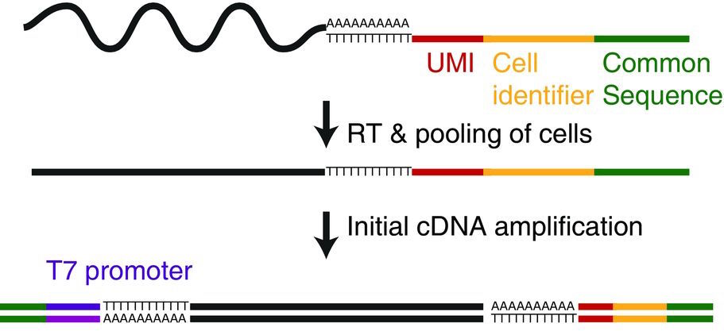

> Velten 2015

## Primer design & labelling strategy 

| Sequence element                  | Function                                                     |
| --------------------------------- | ------------------------------------------------------------ |
| poly-T stretch                    | Select poly-A RNA /  deplete ribosomal RNA-s                 |
| UMI (Unique Molecular Identifier) | Label each mRNA molecule before amplification : correct for amplification bias at the end |
| CBC (Cell Barcode)                | Each mRNA is labeled by cell of origin: samples can be pooled /  multiplexed after this step → less labor |
| Illumina adapter                  | 2 of these are required for sequencing                       |

## Unique Molecular Identifiers (UMIs),

> Kivioja 2012

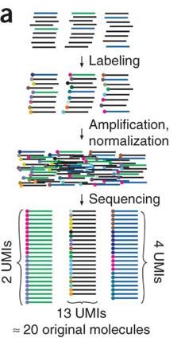

You can do better than just read counting, reads that map to the

-  Same gene and have,
-  same CBC &
-  same UMI
can be collapsed.

## In-vitro transcription or PCR amplifies your 

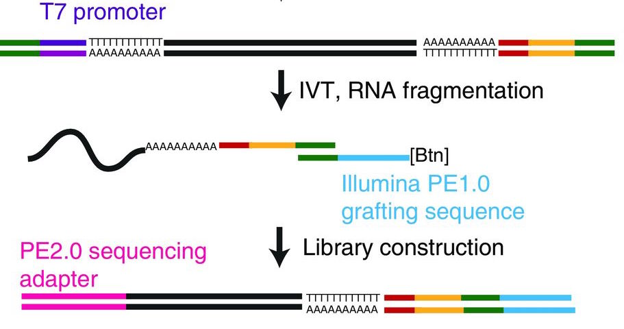

> Velten 2015

## Linearly amplification by IVT is less noise sensitive to fluctuation in input material

| PCR           | IVT             |
| ------------- | --------------- |
| aRNA = cDNA^n | aRNA = n * cDNA |

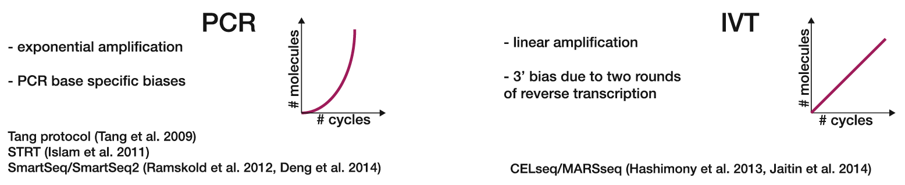

> Kolodziejczyk 2015

- After the invention of UMI, it only spares sequencing costs

## Information in paired end reads

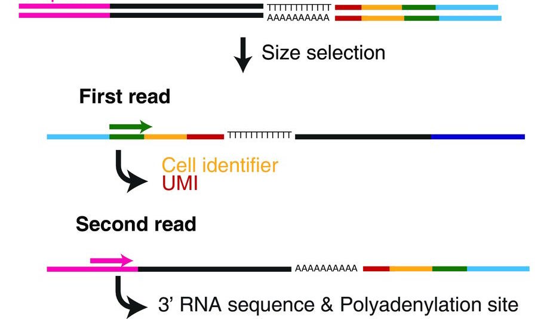

> Velten 2015

## Overview

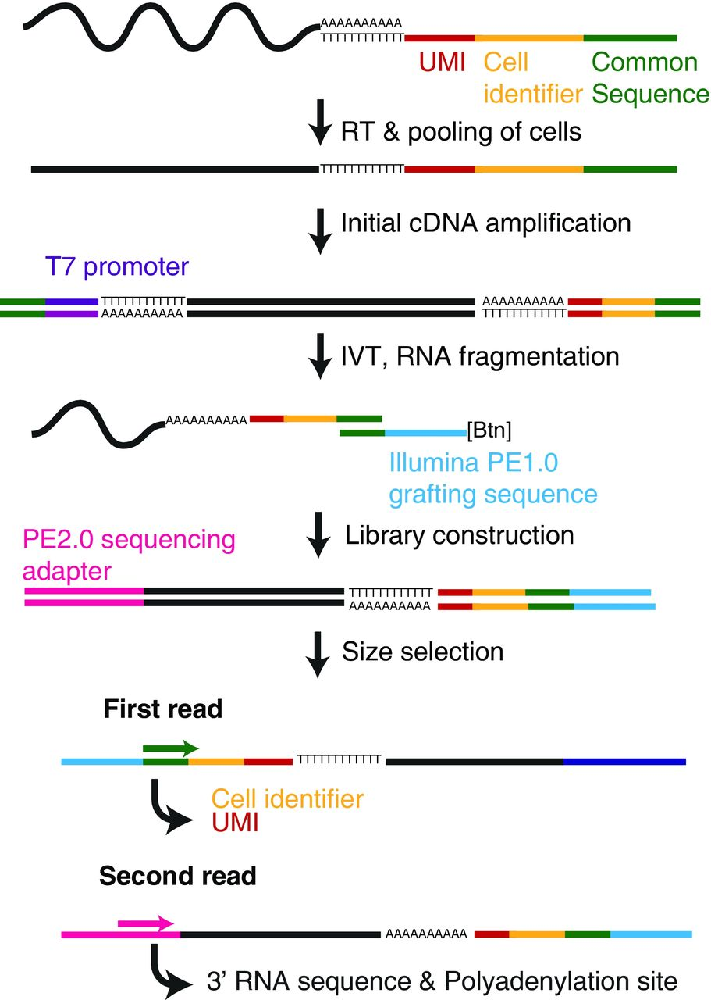 {width=300px}

> Velten 2015
