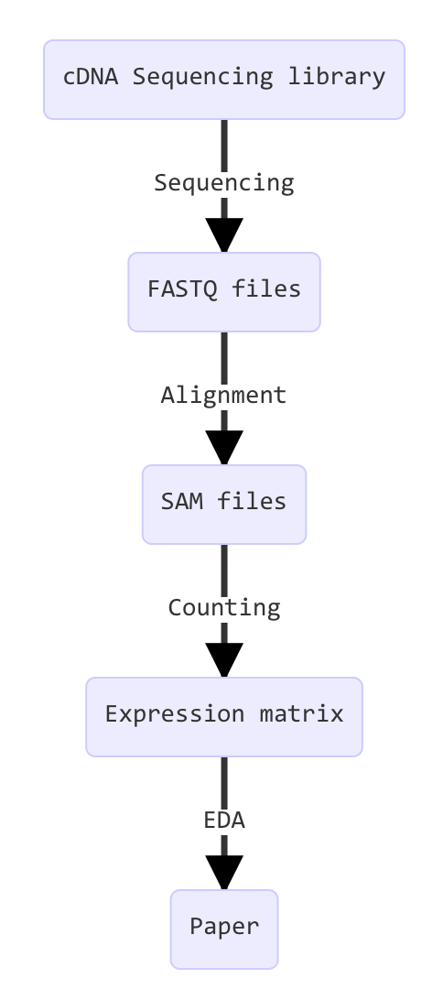

## Transforming data throughout the analysis 

 {width=300px}

## Learning the Unix essentials

- Based on Bradnam & Ian Korf’s excellent online book: 
[Unix and Perl Primer for Biologists](http://korflab.ucdavis.edu/Unix_and_Perl/unix_and_perl_v3.1.1.html)

(Thank goodness, no need for Perl anymore :-D )

## Introduction

Advances in high-throughput methods have transformed modern biology  into an incredibly data-rich science. 

Biologists who never thought they  needed computer programming skills are now finding that using an Excel  spreadsheet is simply not enough. 

## Why Unix?

> - Runs behind Linux and Mac desktop computers and all HPCs (high performance computing clusters)
> - Free → most bioinfo software are written for it
> - Very fast at large data

## Using the Terminal

> - Always pre-installed
> - Many software does not have GUI
> - Interact 
>   - by typing instead of clicking
> - Choose your terminal program if you use it a lot. I use `iterm2` on OSX.

## Your first Unix commands

#### Navigate

> - `ls`
> - `pwd`
> - `cd`
>    - `cd ~`
>    - `cd ./`
> - `..`
> - Relative and absolute path

## Command options (arguments)

> - ***What are these?***
> - `ls`
>    - `ls -a`
>    - `ls -l`
>    - `ls -lh`
> - `man` help
>    - *Google is often faster...*

## Create ...

> - `mkdir`	create a dir
>   - ` mkdir -p Temp1/Temp2`
> 		`touch`	create a file
> 		`cp`		copy
> 		`mv` 		move

## ... and destroy

> - `rm` is an atom bomb: it deletes forever, and does not ask for confirmation.
> -  *“It is possible to delete EVERY file you have ever created with the `rm` command. Are you scared yet? You should be.”*
>   - `rm -i`

## Create your first .fasta file!

> - `nano`, `less` and `more` ...
> - duplicate it
> - make a subfolder 
> - Use the `*.txt`

## Command overview

With some extra's

| The absolute basics | File control       | Viewing, creating, or editing files | Misc. useful commands | Power commands | Process-related commands |
| ------------------- | ------------------ | ----------------------------------- | --------------------- | -------------- | ------------------------ |
| ls                  | mv                 | less                                | man                   | uniq           | top                      |
| cd                  | cp                 | head                                | chmod                 | sort           | ps                       |
| pwd                 | mkdir              | tail                                | source                | cut            | kill                     |
|                     | rmdir              | touch                               | wc                    | tr             |                          |
|                     | rm                 | nano                                |                       | grep           |                          |
|                     | \| (pipe)          |                                     |                       | sed            |                          |
|                     | > (write to file)  |                                     |                       |                |                          |
|                     | < (read from file) |                                     |                       |                |                          |

## Pipe

"pipe-ing” `|` connects the output of one command to the input of the next command → Allows compressed programming.

`head myfile | head | nano`

Use `cat` to read the entire file’s content into another command

`cat myfile | grep ">" | wc -l`

## Finding patterns

> - `grep ">" your.fasta`
> - `grep -v ">"`
> - `wc` :-D
> - `head` and `tail`
> - `grep "^ATG.*ACACAC.*TGA$" chr1.fasta` 
>    - This is a "regular expression"

>- Please take a look at Regular Expressions from the [Text Processing](goo.gl/vMUXAk) lecture in the [Exploratory Data Analysis](https://vertesy.github.io/Exploratory-data-analysis-in-R/) course.

## Thanks for your attention

Edited from Keith Bradnam & Ian Korf’s excellent online book: [Unix and Perl Primer for Biologists](http://korflab.ucdavis.edu/Unix_and_Perl/unix_and_perl_v3.1.1.html).
