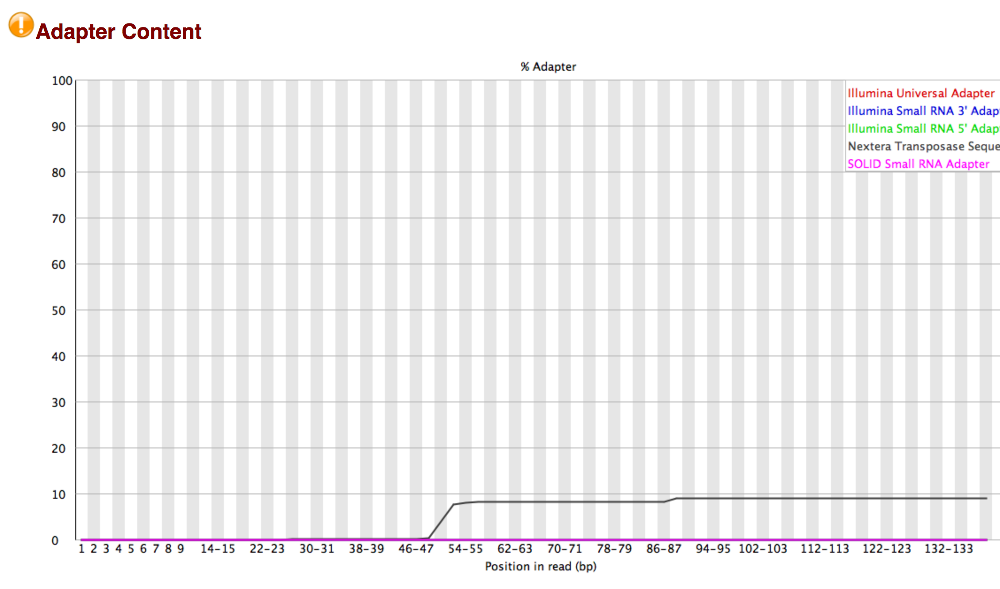
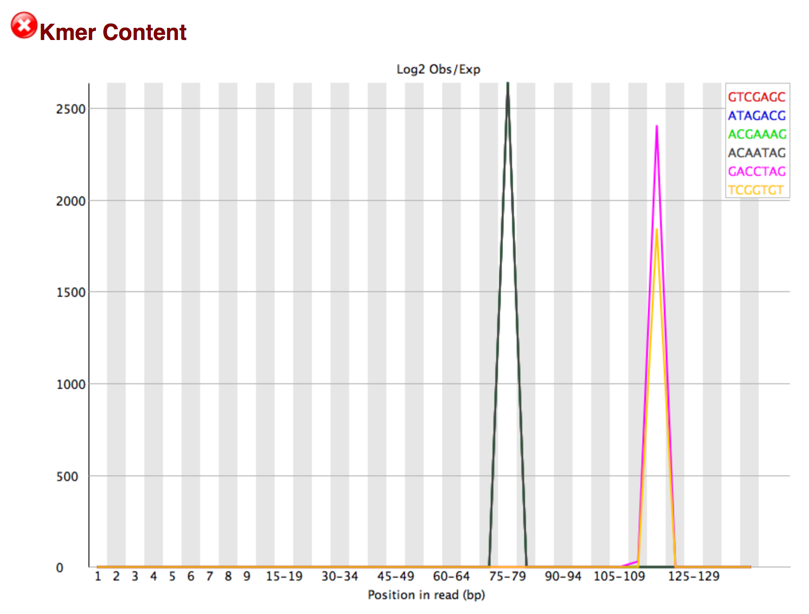
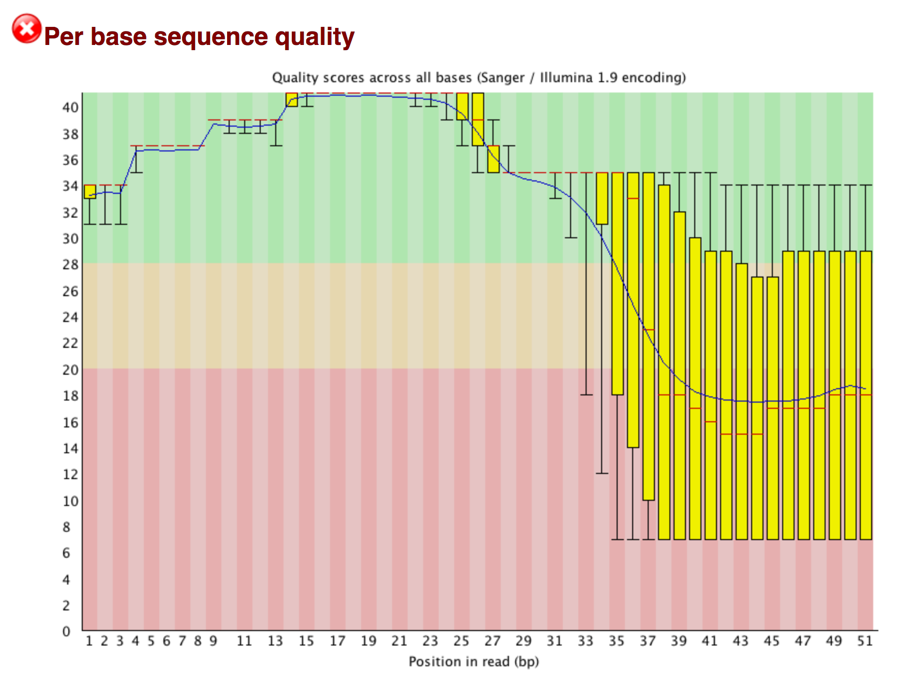
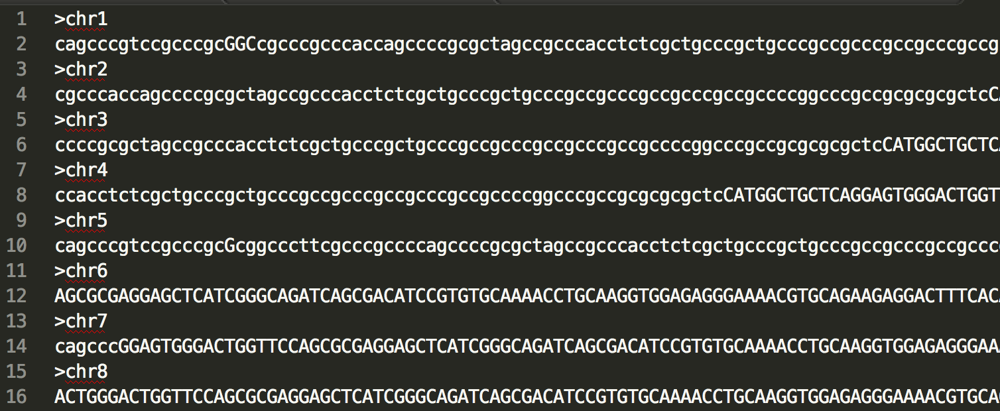
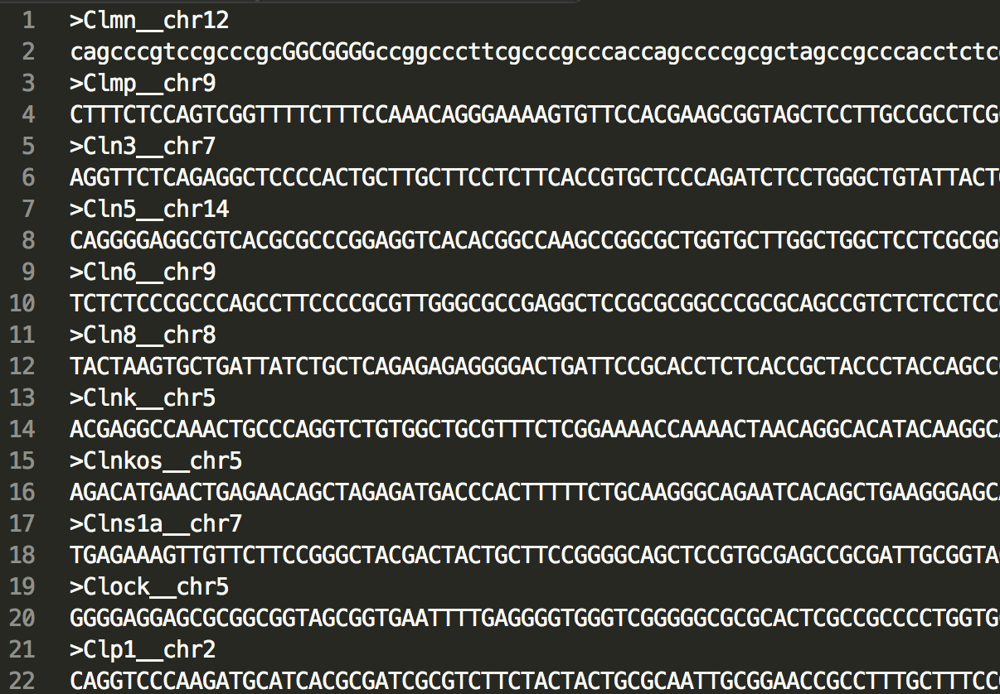
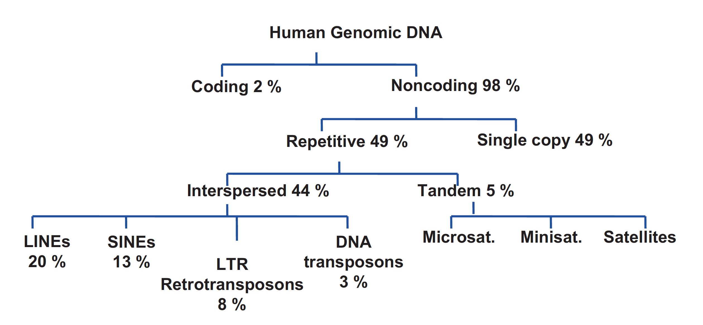

# Processing Raw scRNA-seq Data


## Quality control by FastQC

> - FastQC is a free and lightweight quality control `app` for checking the characteristics of  sequencing data.
> - It is used both for bulk and single-cell RNA-seq data.
> - You can install it like any other apps, but you can run it from the command line too: `fastqc MyExperiment.fastq ` 


## What can go (terribly) wrong with scRNA-seq data? 


> - *In short: Infinite number of things* 
> - Read complexity (same few genes are detected)
>   - Messes up the sequencer's cluster calling
>     - Messes up base quality
> - 


## What can go (terribly) wrong with scRNA-seq data (#2)?


> - Adapter sequences
>   - Adapter dimers, primer dimers
>   - Transpose sequence


## Transposase sequence makes up 10% of the reads!
{width=600px}

---
## A kmer is a k-long sequence often found (e.g: the barcode)
{width=600px}

## Most common problem is decreasing Q over the read
{width=600px}


## Trimming Reads by *Trim Galore!*

> - `Trim Galore!` is a wrapper for the reads trimming software `cutadapt`.
>   - ***What is a wrapper?***
>   - ***What wrapper did you encounter already?***
> - `trim_galore -h` for help


## Trimming

> - You can trim on:
>   - Quality
>   - Custom defined / common adapter sequences to remove
> - `trim_galore --nextera MyExperiment.fastq Share/ERR522959_2.fastq`
> - Outputs a cleaned `.fastq` file
> - Let’s rerun *FastQC*
> - Once you are OK with QC, you are ready for mapping... 
>   - but...


## Mapping is a *computationally expensive* step

So why not removing some more reads that would be useless anyways?
>- *Does your reads have the correct CBC and UMI?*
>- Pre-filtering reads for correct barcodes and UMI


## Mapping (or alignment) is figuring out where each read is coming form


> - Many tools have been developed
>   - [If you have to choose: Just use the one that most people use, but look for up-comers]
> - **<u>What do you need for mapping?</u>**
>   - Your sequencing data (cleaned up)
>   - Reference 


## Mapping Reference


> - You can map to:
>   - reference genome
>   - reference transcriptome
> - See an examples:


## Reference genome

Is a `.fasta` file with 20-24 sequences: the chromosomes.

{width=600px}

## Reference transcriptome

{width=600px}


## When would you choose either of these?
>   - Speed
>   - Pseudogenes / multi-mappers
>   - Simplicity / convenience 


## What I mean about speed:

##### Organisation of the human genome




## Mapping is an art on its own...

Why that? - It’s simple:
>- Using R you could write it yourself
>  - compare base to base `“A”=="A"`
>  - `your.base == base.in.reference` 
>    - in 2 gigantic for loops
>- *Comparing every base in your read vs every base in the reference is This is way to slow*
>- When you try to speed it up, it soon gets very complicated
>  - Creating a search index (lookup) for the reference is usually a key step
>- There are a lot of other issues


## Example ‘Splice aware’ alignment to catch reads that overlap exon junctions

- `STAR` is such an aligner


## Practical steps

Two steps are required to perform `STAR` (or most other) alignments. 


## Step 1: Create a reference index

A search index for the reference is usually a key step

>- a reference genome sequences (FASTA) and
>- genome annotation file (GTF)
>    - used to create a genome index
>    - only for each genome/annotation combination


```bash
mkdir indices
mkdir indices/STAR
STAR --runThreadN 4 --runMode genomeGenerate --genomeDir indices/STAR --genomeFastaFiles Share/Reference.transcripts.fa
```


## Step 2: Align your data

- Your reads (FASTQ) mapped to to the reference (FASTA) using the genome index (various files and extensions).

```bash
mkdir results
mkdir results/STAR

STAR --runThreadN 4 --genomeDir indices/STAR --readFilesIn Share/ERR522959_1.fastq Share/ERR522959_2.fastq --outFileNamePrefix results/STAR/
```

>- After alignment you have a `.sam` file


## Working with aligned data


- Conversion (depending on the file format)
- Counting 
- Checking reads (if necessary)


## Use samtools to convert `.bam` to `.sam`

*Part of the **HTSlib** (High Throughput Sequencing Library )*

SAMtools provide various utilities for manipulating alignments in the SAM format, including

- .bam / .sam conversion
- sorting, 
- merging, 
- indexing and 
- generating alignments in a per-position format.

We wrote our own scripts to count reads per gene and cell, 
and finally create an expression matrix 

→ We need a .sam file as input and the aligners typically generate a .bam file


## Manually inspecting (mapped) files

> - Sometimes necessary to check the raw data
>   - You find an unexpected gene highly expressed 
>   - Check the raw reads
>   - Maybe you find that reads mapping to that gene are essentially a poly-T stretch `ATTTTTTTTTTTTTTTTTTTTN`.
> - You can best use linux command line tools
>   - ‘less’, ‘more’, ‘nano’ and ‘vi’ can be used to inspect any text files from the command line.
> - Use `samtools` to view 


## Commands to view files

You learned yesterday some commands:

```bash
head MyExperiment.fastq
nano MyExperiment.fastq
```

```bash
# After maooing
# You can use "samtools" to convert a .bam into a .sam
samtools view -h file.bam # creates a .sam

# Use pipe to count the number of lines in file.txt
# counts the number of lines in the samtools output
samtools view -h file.bam | wc -l

# Check the file
wc -l file.txt
samtools view -h file.bam | head | more

# Select a certain chromosome (if mapped against the genome)
samtools view -b in.bam chr1 > in_chr1.bam

# ...or per gene if mapped against the transcripome
samtools view -b in.bam Pou5f1__chr19 > in_chr1.bam
```


## Creating the gene expression matrix

3 ways to count

>- Read count (Simplest)
>- UMI count (filtered for duplicates)
>- Transcript count (using a statistic model for UMI sampling)


## Sampling correction of UMI observations for transcript counting

##### The Number of UMI-s is not linearly correlated with the reads.

`Why?`

You are sequencing molecules from a large pool of molecules. This is a sampling process.

Imagine:

>- Sampling marbles from a box
>- marbles are of 256 colors
>- In **sampling with repacement**, what is the chance that you see
>   - 20 different UMI in 20 reads?
>   - 200 different UMI in 200 reads?
>- It is going to be less: you will start pulling the same color more than once...


## Asking the reverse question to extrapolate the number of original mRNA molecules from the number of UMI!

- You could ask the reverse question: I see 20 different UMI in 25 reads, how many UMI were there in the box?

> This is what we do in when we convert reads to transcript-counts.

Read more about the [mapping process](https://github.com/vertesy/TheCorvinas/wiki/MapAndGo-Mark-II).


## Our pipeline for mapping: MapAndGo2

##### Steps it automates

1. Unzipping everything
2. Concatenation of lanes
3. Extracting read and UMI info from R1.fastq and adding it into R2.fastq
4. Removal of cells with invalid CBC-s (cell barcodes) or UMI-s with `N`-s
5. Single end mapping
6. Conversion to count tables (usual UMI correction, etc)
7. Zipping up everything
