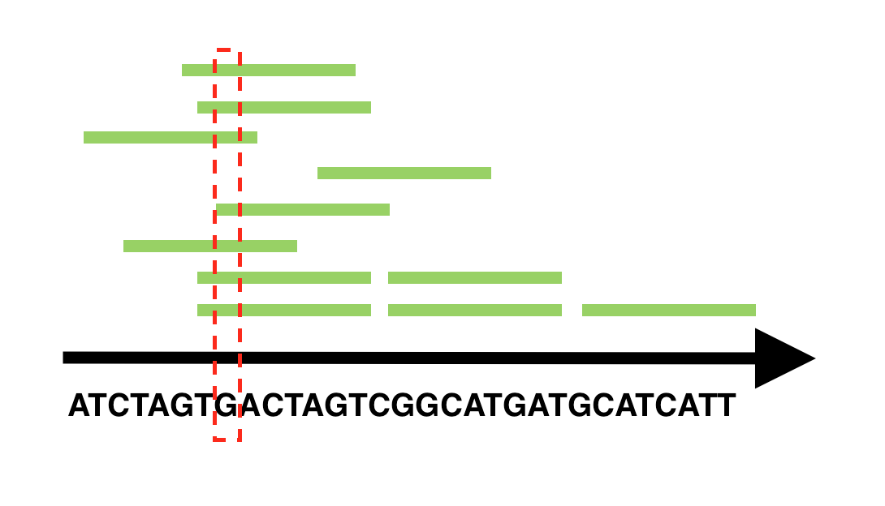

## File formats in sequence analysis

 {width=300px}

## FastA format to store sequences (and align them)

```
>SequenceID
SEQUENCE (ATGCAGTATAG)
```

##### Used for proteins too
```
>gi|5524211|gb|AAD44166.1| cytochrome b [Elephas maximus maximus]
LCLYTHIGRNIYYGSYLYSETWNTGIMLLLITMATAFMGYVLPWGQMSFWGATVITNLFSAIPYIGTNLV
EWIWGGFSVDKATLNRFFAFHFILPFTMVALAGVHLTFLHETGSNNPLGLTSDSDKIPFHPYYTIKDFLG
LLILILLLLLLALLSPDMLGDPDNHMPADPLNTPLHIKPEWYFLFAYAILRSVPNKLGGVLALFLSIVIL
GLMPFLHTSKHRSMMLRPLSQALFWTLTMDLLTLTWIGSQPVEYPYTIIGQMASILYFSIILAFLPIAGX
IENY
```
> - **The reference Genome / Transcriptome will also be stored as FASTA!**


## FastQ (after sequencing)

*Name: Fasta with Quality-score from the sequencer* 

FastQ is the most raw form of scRNASeq data you will encounter. 

For paired-end sequencing, you will have 2 `.fastq` files with matched names, and matched reads, line-by line

FastQ files have the format:

```
>ReadID
READ SEQUENCE
+
SEQUENCING QUALITY SCORES
```


## SAM (after mapping)

Name: Sequence Alignment Map

A header, which typically includes information on the sample preparation, sequencing and mapping; 

A body: a tab-separated row for each individual alignment of each read.

```
Header
listing all chromosomes or transcripts (depending on your reference)

Body 
1 read per line + a lot of additional fields
```

##### Example
```
@SQ    SN:chr1    LN:50
@SQ etc...


1:497:R:-272+13M17D24M  113  1  497  37  37M  15  100338662  0  CGGGTCTGACCTGAGGAGAACTGTGCTCCGCCTTCAG  0;==-==9;>>>>>=>>>>>>>>>>>=>>>>>>>>>>  XT:A:U  NM:i:0  SM:i:37  AM:i:0  X0:i:1  X1:i:0  XM:i:0  XO:i:0  XG:i:0  MD:Z:37

1:497:R:-272+13M17D24M  113  1  497  37  37M  15  100338662  0  CGGGTCTGACCTGAGGAGAACTGTGCTCCGCCTTCAG  0;==-==9;>>>>>=>>>>>>>>>>>=>>>>>>>>>>  XT:A:U  NM:i:0  SM:i:37  AM:i:0  X0:i:1  X1:i:0  XM:i:0  XO:i:0  XG:i:0  MD:Z:37
```


## Interpreting the .sam file

| Field name | description                      | Example-data                                                 |
| ---------- | -------------------------------- | ------------------------------------------------------------ |
| QNAME      | read name                        | 1:497:R:-272+13M17D24M                                       |
| FLAG       | alignment flag                   | 113                                                          |
| RNAME      | alignment chromosome             | 1                                                            |
| POS        | alignment start position         | 497                                                          |
| **MAPQ**   | overall mapping quality          | 37                                                           |
| CIGAR      | alignment CIGAR string           | 37M                                                          |
| MRNM/RNEXT | name of next align. ...          | 15                                                           |
| MPOS/PNEXT | pos. of next alignm. ...         | 100338662                                                    |
| ISIZE/TLEN | observed Template LENgth         | 0                                                            |
| SEQ        | sequence                         | CGGGTCTGACCTGAGGAGAACTGTGCTCCGCCTTCAG                        |
| **QUAL**   | quality per base                 | 0;==-==9;>>>>>=>>>>>>>>>>>=>>>>>>>>>>                        |
| **TAGs**   | further tags with alignment info | XT:A:U NM:i:0 SM:i:37 AM:i:0 X0:i:1 X1:i:0 XM:i:0 XO:i:0   XG:i:0 MD:Z:37 |


## Important fields:

- Read length → What sequencer was used?
- Trimming bases → **QUAL**
- Filtering out and reads → **MAPQ, TAGs**
  - Not align robustly aligned 


## BAM

The machine-readable version of SAM file and it is highly
compressed. 

BAM/SAM files can be converted to the other format using 'samtools':


```bash
samtools view -S -b file.sam > file.bam
samtools view -h file.bam > file.sam
```

BAM files can be converted back to FastQ using bedtools. 


## What can you do with `.sam` file?


1. You can filter out reads that are not aligned with a high quality

    1. Cannot be mapped
    2. Maps to mult
        1. The shorter the read the more problematic this is

2. *Based on .sam files, you can **count your reads per gene***

    → See: Construction of expression matrix

3. Create pileup file


## Use pileup files to see genetic variation and sequencing errors per position





## Other formats: GFF, GTF 

**Genome annotation files**, used to create a `genome index` or `reference transcriptome` from the reference genome.

GTF files contain annotations of genes, transcripts, and exons. They must contain:

- `.tsv ` style, key fields:
  - feature.name &
  - range
- Empty fields are marked with "."
- Download it from: [Ensembl](http://www.ensembl.org/info/data/ftp/index.html), [NCBI](ftp://ftp.ncbi.nih.gov/genomes/), or [UCSC Genome Browser](http://hgdownload.soe.ucsc.edu/downloads.html).


