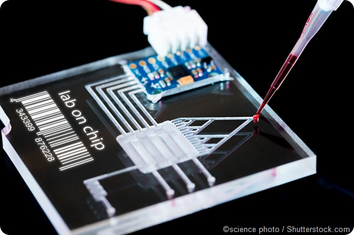
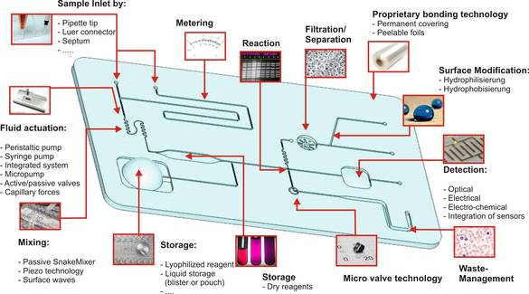
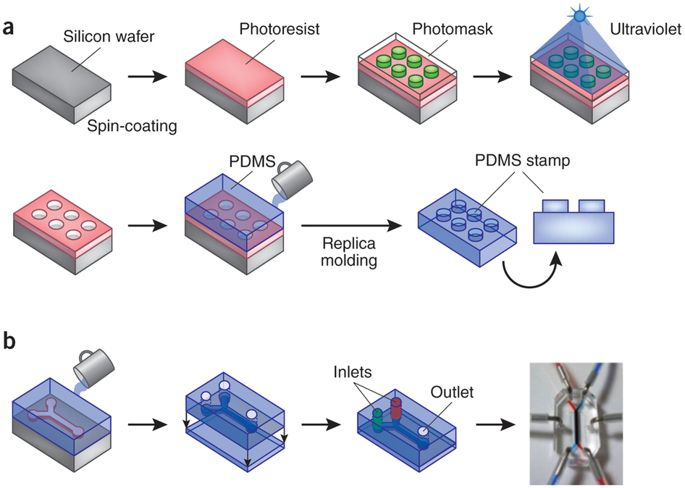
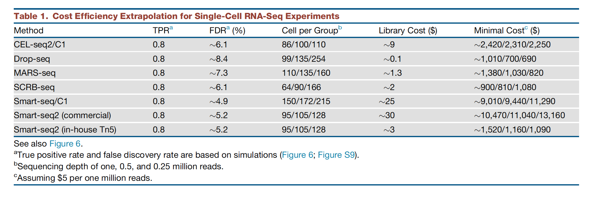

## Microfluidics

## Concept of microfluidics

>- Carve hair-thick channels into a plastic (PBMS = Polydimethylsiloxane).
>- Your samples travel through a labyrinth of channels with chambers.
>- In each chamber (or section of channel) you can perform a reaction.

## Adavantages of microfluidics

>- Small volume
>   - less reagent
>   - less dilution of small samples
>- Small space required
>- Small thermal mass / fast heat transfer
>- Fast mixing by diffusion
>- Precise flow control (laminar flow)
>- Protected from contamination
>- Automation is easy
>- ... but its complicated...

## Fabrication of microfluidics chips

## Microfluidics for single-cell mRNA seq

[Watch video from Dolomite - click here ](https://www.youtube.com/watch?v=zQoHc6PtIFk)

## Sequencing prices
>  Source: Ziegenhain 2017

>- Drop-seq (690\$) is the most cost-effective method when sequencing 254 cells at adepth of 250,000 reads, and 
>   - **2.7$ per cell**
>- SCRB-seq (810$), 
>- Mars-Seq (820\$), and 
>- Smart-seq2 (1,090$, with in-house-produced Tn5 transposase) 

## Cost comparison of key methods

## [10X Genomics](https://www.10xgenomics.com/single-cell/): 3'mRNA-Seq

- A new (2016) commercial chip+kit to sequence 10K’s of cells using microfluidics.
- Around 1,000 to 10,000 cells are captured in  just 10 minutes.
- Workflow similar to DropSeq: capture cells with beads,  release RNA, oligo-dT primed cDNA to get a 3' mRNA-seq library.

## “Economy of scales” for preparation  but not for sequencing 

> Prices @ Cambridge facility
>  https://genomics.cruk.cam.ac.uk/services/Single-cell

**Costs:** **£1500ish per sample:** 

>- £1200  per sample for the single-cell 3'mRNA-Seq library prep. 
>   - for 1000 cells 1.2£
>   - for 10000 cells 0.12£
>- £200 for 1000 cells at 50,000 reads each (assuming multiplexing samples in a HiSeq  4000 lane)
>   - for 1000 cells @ 250K: 1000£
>   - for 10000 cells @ 250K: 10000£

## Slashing prices

>- **Multiplexing on the sequencing lane:**
>  There are different illumina index primers
>- There is always a lot of trouble shooting: 
>  choose a **method that can do a 100 cells** for the first couple of pilot rounds.
>- Use of **in-house enzymes** instead of commercial kits
>- **Gene specific primers**:
>  instead of the polyA primer, you can make a set of 100 gene specific primers to subset to genes
>- **Pull-down of ready libraries**:
>  You can try to remove genes from the ready library by pulldown (biotin labeled DNA primer complementary to say, *Hemoglobin*)
