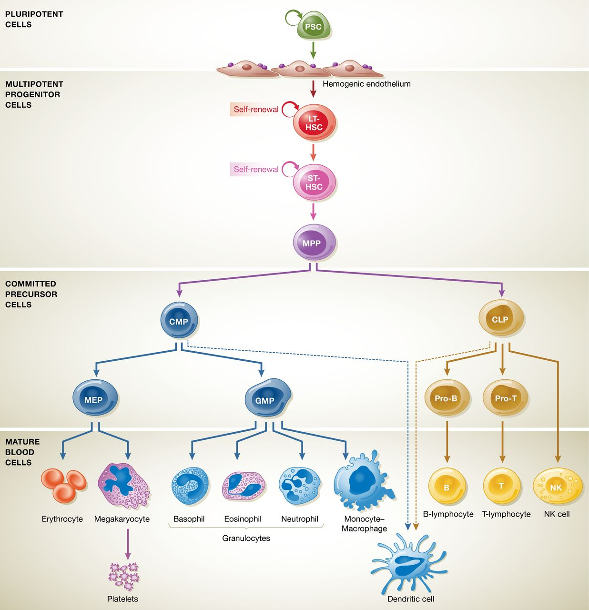
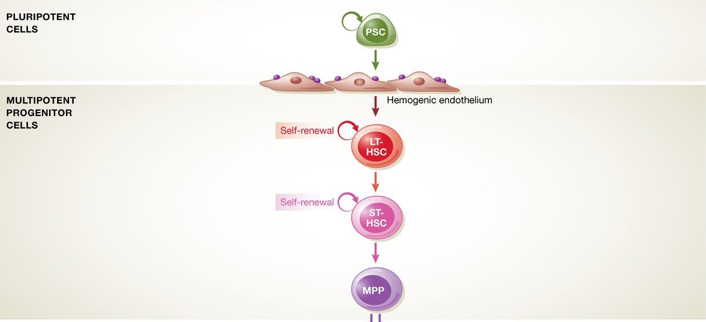
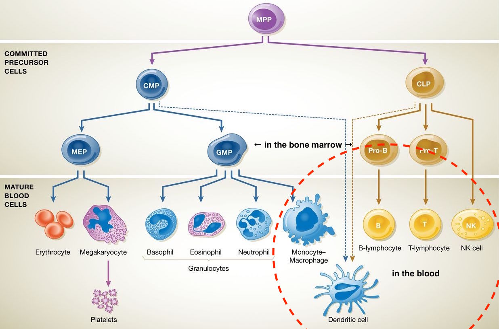
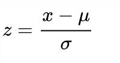
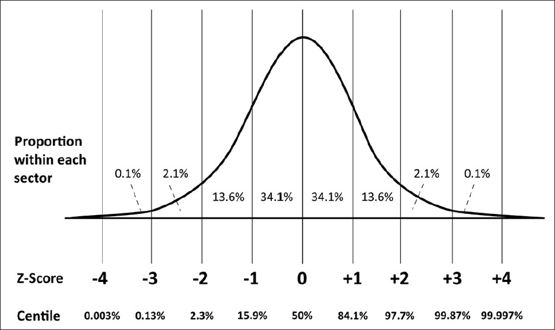

## Disclaimer

- Using data from:
  *Zheng, G. X. Y et al. (2017) ‘Massively parallel digital transcriptional profiling of single cells’. doi: 10.1038/ncomms14049.*
- Following steps of the [Seurat Tutorial](https://satijalab.org/seurat/pbmc3k_tutorial.html)
- Download the data from: https://bit.ly/2mVpJvM


## Example case: Study the immune system

- We isolated and sequenced cells from the blood.
- To study immune populations within blood cells, we obtained fresh PBMCs from a healthy donor
- [Publicly available data from 10X genomics](https://support.10xgenomics.com/single-cell-gene-expression/datasets/1.1.0/pbmc3k)


## Peripheral blood mononuclear cells (PBMC)

A **PBMC** is any peripheral blood cell having a round nucleus. These cells consist of:

-  **lymphocytes**
  - **T cells,**
  - **B cells,**
  - **NK cells (natural killer cells),**
-  **monocytes (macrophage precursor).**


**Other cell types in the blood:**

- Erythrocytes and platelets have no nuclei, and
- granulocytes (neutrophils, basophils, and eosinophils) have multi-lobed nuclei.


## Multipoptent progenitors give rise to *lymphoid* and *myeloid* lineages

{width=450px}


## A quiescent stem cell is activated to proliferates through multiple stages




## PBMCs are both part of the  *lymphoid* and *myeloid* lineages




## Dataset: 3k PBMCs from a Healthy Donor

Single Cell Gene Expression Dataset by Cell Ranger 1.1.0

Peripheral blood mononuclear cells (PBMCs) from a healthy donor (same donor as pbmc6k).

PBMCs are primary cells with relatively small amounts of RNA (~1pg RNA/cell).

- 2,700 cells detected
- Sequenced on Illumina NextSeq 500 with ~69,000 reads per cell
- 98bp read1 (transcript), 8bp I5 sample barcode, 14bp I7 GemCode barcode and 10bp read2 (UMI)
- Analysis run with --cells=3000

Published on May 26, 2016

This dataset is licensed under the[ Creative Commons Attribution](https://creativecommons.org/licenses/by/4.0/) license.

[Link to summary html file](http://cf.10xgenomics.com/samples/cell-exp/1.1.0/pbmc3k/pbmc3k_web_summary.html)

## Wake-up (brainstorming) exercise #1: you are the data analyst of this project

You learnt many things already about the concepts of (single-cell) data analysis and machine learning during the EDA course.

Start a new text document and write down in bullet points:

1. What questions can you ask?
   1. There are no wrong questions at this point, just try to get on paper as many questions as you can.
   2. Use your biological intuition,
   5. experiences in your own project (or studies), and
   4. ask for more info if you need (I did not work with )


**Open one of the shared excel files.**


## Wake-up exercise #2:

> 1. How would you answer them?
>    1. Which methods that we learned about / heard about before?


> 2. How would you put them together into a pipeline?
>    Think about what
>    1. steps of
>    2. analysis
>    5. would you
>    4. do?

Hint:

1. First just try to find a method that can answer each of your questions
2. Order them into a logical order


## 1. What questions would I ask?

I would ask:

> - Is our dataset high quality ?
>    - How many UMI per cell do I see?
>    - How many genes per cell do I see?
> - What cell types do we see?
>    - Do we see all expected, and no unexpected cell types?
> - What is the proportion of these cell types?
> - What genes are expressed in each type?
> - What genes distinguish the cell types (marker genes)?
>    - Are these marker genes uniformly expressed, or is there variation among them?
> - Can we find sub-types?
>    - e.g.: are there multiple kind of T-cells?


## 2. / 5. How would I approach my questions?

> 1. Quality control and filtering:
>    1. Visualise the distribution of read counts and gene counts
>    2. Filter out the bad cells
>    5. (Identify variable genes)
> 2. Clustering
>    1. Check for batch effects
> 5. Visualise clusters and heterogeneity
>    1. t-SNE (a non-linear dimensionality reduction method)
> 4. Differential gene expression
>    1. Find genes marker genes
> 5. Gene set analysis: find functional relevance in genes
> 6. [Loop between any of the steps above]


## 2. / 5. How SEURAT approaches these questions?

> 1. Quality control and filtering:
>    1. Visualise the distribution of read counts and gene counts
>    2. Filter out the bad cells
> 2. Heterogeneity of the data
>    1. Identify variable genes (it is also a )
>    2. Visualise
>       1. PCA (Principle Component Analysis, a *linear* dimensionality reduction method)
>       2. t-SNE (t-Stochastic Neighbourhood Embedding , a *non-linear* dimensionality reduction method)
> 5. Clustering
>    1. Seurat `Graph based clustering`  based on `Principle Components` instead of genes.
> 4. Differential expression
> 5. Sub-clustering
>


## 5.4 Input data formats

>- Simple data frames
>   - Genes per row
>   - Cells per column
>   - Stored as `.tsv` (or `.xlsx`) files
>   - Lets take a look at an example
> - Sparse matrix files
>   - Stored as an `.mtx` file


## Why not just using Excel style tables (data frames)?

Single-cell data is special, because

- large size and
- sparsity of the data (90% of the tables can be 0s)


## Sparse matrices can be stored in `.mtx` files

Name: ` MatrixMarket` format.

- Plain text format.
- Used for exchanging and storing test matrices.

> - Check out the file using the bash `head` command.
> - Try to interpret what you see:
>    This is a file format you never heard of but you can **recognise some patterns** + you learned sth about the typical structure of files
>    - Separate the output
>    - What are the parts of this file?
>    - What are in the columns?


## Structure of the `.mtx` (solution)

> - You will see...
>    -  **2 header lines** (% sign is a common way to annotate “comments” or headers - similarly to the # sign.
>    -  followed by a line detailing the **total number of rows, columns and counts** for the full matrix.
>    -  Entries per line in the following format: `rows, columns, entries`
>    -  Since only the coordinates are stored in the .mtx file, the
>       -  names of each row & column must be stored separately in the
>           "genes.tsv" and "barcodes.tsv” files.


## R can open .mtx files using the Matrix package

- Installed as a dependency to `Seurat`
- require ("Matrix")


## Load the data and create a Seurat object

```R
#' Load the PBMC dataset
pbmc.data <- Read10X(data.dir = InputDir)

#' Initialize the Seurat object &
#' do some prefiltering
pbmc <- CreateSeuratObject(raw.data = pbmc.data, min.cells = 3, min.genes = 200, project = "10X_PBMC")
```

... Open an R script and load the data!


## “Seurat” is and <u>object</u>, a new data structure

Objects are:

- the most **complex data structures** we encountered,
- central idea for `object-oriented programming`.
- You can think of it as a list


## What is pbmc in r?

What data structure is created?

```
# Figure out what
is(pbmc)
str(pbmc)

```

> - pbmc is a `class` or in other words: an `object`


## 5.4.1. Filtering genes and cells

- Problem
  - The dataset is huge how an I make it workable?
- Filtering
  - Rough-cut:
    - Keep all genes expressed in >= 3 cells
    - Keep all cells with at least 200 detected genes
  - Remove QC-outlier cells:
    - % of mitochondrial genes
    - Read counts


## Filtering genes and cells in Seurat

... Go back to the R script!


## 5.4.2. Normalisation

- Problem:
  - Each cell has *very* different read counts - how to compare?
  - Cells should be normalised to comparable expression level
- `LogNormalize()` provides a typical way to normalise data

  - divide by the total expression
  - multiplies this by a scale factor (def: 10K)
  - log-transforms the result
    - gene expression is regulated on the fold change level
  - ***Who can do this in R?***


## 5.4.3. Identify the most variable genes

- Problem:
  - the dataset is still huge...

  - How can I remove the uninformative (homogenous) part of the data?
- `FindVariableGenes()`
  - calculates the average expression & dispersion for each gene
  - bin per expression level,
  - calculates a z-score for dispersion within each bin.
    - ***What is Z-score?***

----

### Z-score normalisation

a.k.a.: Standard score

Definition:

The distance from the mean, as a number of standard deviations (STD).


Z-score calculation:



(value - mean) / STD


----

### Z-scores of the normal distribution




## ***When would you use the Z-score ?***

> - Think abstractly!
> - What kind of comparison?


## 5.4.4. Removing unwanted sources of variation by linear regression (“scaling”)

- Removing unwanted sources of variation by linear regression (“scaling”)

To mitigate the effect of confounding factors,

- `Seurat` **constructs linear models** **to predict gene expression based on user-defined variables**.
  - The residuals of these models are used later for dimensionality reduction and clustering.


## Removing confounding effects in Seurat

- `Seurat` can regress out cell-cell variation in gene expression
  - driven by batch,
  - mapping quality
  - the number of detected molecules
  - mitochondrial gene expression and
  - cell cycle.
  - Here we regress on the number of detected molecules per cell.


## 5.4.5. Linear dimensionality reduction by PCA

**See the [5.4.1.Linear.dimensionality.reduction.by.PCA.html](../5.4.1.Linear.dimensionality.reduction.by.PCA.html) slides!**


## 5.4.6. Clustering

**See the [5.4.6.Clustering.html](../5.4.6.Clustering.html) slides!**


## 5.4.7. Non-linear dimensional reduction (tSNE)

**See the [5.4.7.Non-linear.dimensionality.reduction.by.tSNE.html](../5.4.7.Non-linear.dimensionality.reduction.by.tSNE.html) slides!**


## 5.4.8. Finding differentially expressed genes (DEG)

**Questions:**

- What define the clusters?
- What genes are expressed in them?
- Which are specific?

**See the [5.4.8._Finding.differentially.expressed.genes.DEG.html](../5.4.8._Finding.differentially.expressed.genes.DEG.html) slides!**


## 5.4.9. Gene set analysis

#### Problem:

- Many DEG, but what do they really mean?
- Is there a common function?

**See the [5.4.8._Finding.differentially.expressed.genes.DEG.html](../5.4.8._Finding.differentially.expressed.genes.DEG.html) slides!**

