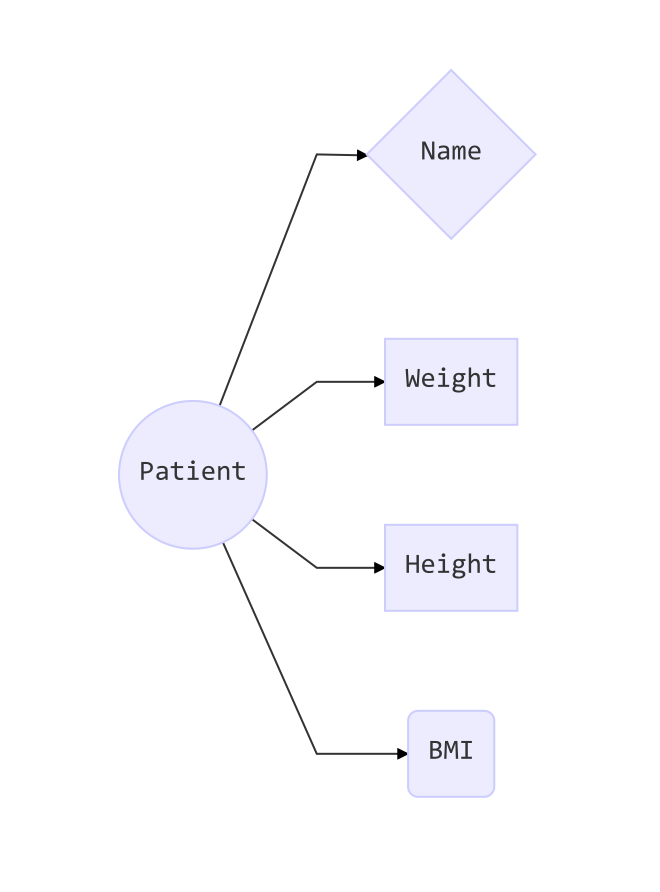

## Recap: Data structures in R

{width=400px}

## Motivation for "Objects"

>- Real "items" are more complext than just a dataframe:
>   - Think of designing an informatics system for a hospital
>     - You have many patients
>     - Patients have a lot of attributes
>       - Name, Height, Weight			→ Can store it in a row of a data frame
>       - Medication history, CT-scans 	→ Cannot store it in a row of a data frame
>- → A new way of storing is needed an: object
>- In a very simple way, you can think of it as a *list* on steroids.

## Patient is `class` of object with concrete `instances`,  like poor John

- Class is a type of object: Think of `patients` and `doctors` in the hospital.
- Instance is a concrete example

{width=400px}

## Calculate BMI from 2 other attributes

{width=400px}

## BMI is a new attribute of “patient” 

{width=400px}

## Motivation for "Object oriented programming"

>-  If you always handle the same kind of objects, you can design the functions to work specifically with those objects!
>    -  Write a simple function for BMI: `calc_BMI()`
>       -  `calc_BMI(Weight, Height)`
>    -  But you know that all patients have these attribute, so you could write a simple function
>       -  `calc_BMI(Patient)`
>    -  This function can put back the BMI immediately to the object `Patient`.
>    -  These functions for object are called **methods**.

## Methods are functions designed to work with a type of object. 

>-  A method is a function designed for a particular type of object. 
>-  Most Seq-data analysis packages work with R
>    -  Imagine a function like
>       -   `Cell_quality(SingleCellObject)`
>       -   `Cluster_SC(SingleCellObject)`

## Object oriented programming in R

- S4 objects (there are other kinds)
- Subset the elements by the `@` character

#### References:

http://adv-r.had.co.nz/S3.html

http://adv-r.had.co.nz/S4.html

## Take home messages for object oriented programming

- Life is too complex for a data frame → invention of **objects**.
  - Type of object is called **class**.
  - An example of that class is called **instance**.
- Writing functions to work with objects, called **methods**.
