## High dimensional data

> - Each measurement is a distance (think of distance in 1D)
> - Now think of each gene as a distance in each dimension
>    - Dimension, by definition are independent: i.e. their values are not correlated
>    - ***Think of X,Y, Z in a 3D plot***
> - But expression of genes is often not independent: Co-regulation is infact very frequent.

## You can think of your data as vectors

- **Euclidean vector** is a geometric object that has a length and direction.
- Each measurement is a dimension
- Each cell is point in n-dim space - can be represented by a vector

**2D Vector**
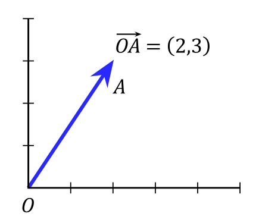

**3D Vector**
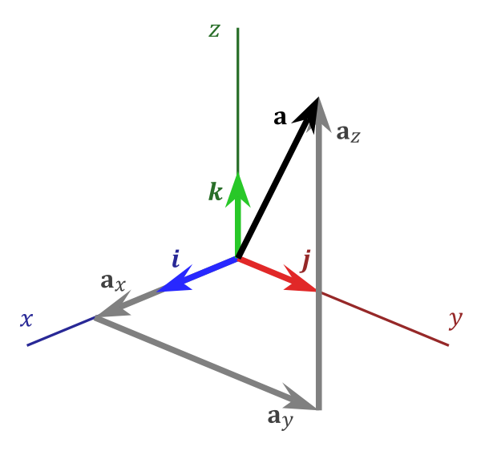

## High dimensional data

- You can have vectors in more than 3D.
- Imagine every gene expression values on each axis

## Dimensionality reduction

When working with large datasets, you need to reduce dimensionality to be able to analyse and interpret.

You “project” the data onto a lower-dimensional “sub-space”.

- This reduces the amount of noise
- Much easier to visualize

## Linear and non-linear dimensionality reduction methods

Linear method assume the independent dimensions are a linear combination of the original dimensions.
- PCA

Non-linear methods:
- tSNE (more resource hungry)

# Introduction to Principal Component Analysis (PCA)

Based on [Laura Diane Hamilton](http://www.lauradhamilton.com/introduction-to-principal-component-analysis-pca)‘s blog.

## Principal Component Analysis (PCA)

[**Principal Component Analysis (PCA)**](http://en.wikipedia.org/wiki/Principal_component_analysis)  is a **dimensionality-reduction technique** that is often used to transform a high-dimensional dataset into a smaller-dimensional subspace prior to  running a machine learning algorithm on the data.

Wikipedia:

**Principal component analysis** (**PCA**) is a statistical procedure that uses an [**orthogonal transformation**](https://en.wikipedia.org/wiki/Orthogonal_transformation) to convert a set of observations of possibly correlated variables into a set of values of [linearly uncorrelated](https://en.wikipedia.org/wiki/Correlation_and_dependence) variables called **principal components**.

## When should you use PCA?

Reducing the dimensions is useful:

>- to **simplify the dataset**:  “get rid of" uninformative dimensions.
>- to show a **“summary” of variation** of your data
>- find out **what combination of original variables** explain the differences
>- **prior to performing machine learning**, to gain speed (reduce calculations).
>- to **reduce the degrees of freedom** →  reduces the risk of  overfitting statistical models.

## What does PCA do?

> - Finds the  principal components, thereby
> - transforms the data into a new coordinate system
> - In this coordinate system, the first axis [PC1] is a component, that
>   - explains the greatest amount of  the variance in the data.
>   - is a (linear) combination of the original axes
> - You can select the most informative PCs (dimensions after transformation) to arrive to lower dimensionsal subspace

# Let’s PCA!

## Original data

Let’s say your original dataset has two variables, x1 and x2:

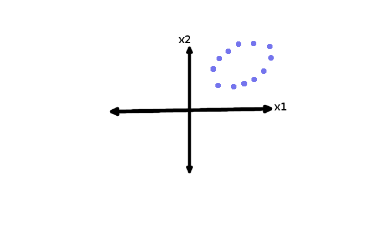

## Find the axis with the largest variation!

... by rotating the axes.

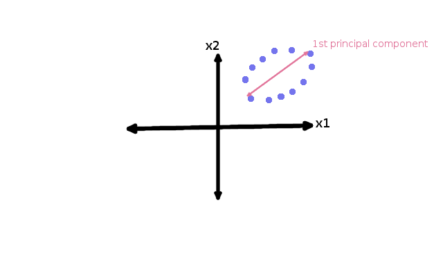

## Calculate the 2nd principal component?

For our two-dimensional dataset, there can be only two principal components, therefore 2nd one is given:

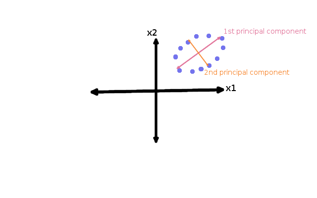

## The second principal component

The second principal component **must be orthogonal to the first principal  component**. In otherwords, it does its best to capture the variance in  the data that is not captured by the first principal component.

> - For a 3D dataset, after finding PC1, you can rotate in 2 more dimension, while 1 is fixed.
> - After finding each dimension you have one less degrees of freedom

## PCA projection of the data

... is just a linear transformation (rotation) of the original dimensions.

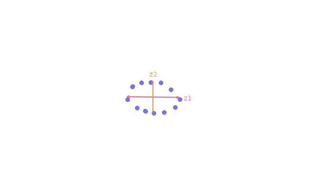

## Steps of PCA

> - Create a new axis (PC)  that explains the highest amount of variance.
> - The original x1 and x2 are a somewhat correlated, so..
> - Let’s rotate them: a 45’ line in this case is the direction of the largest variation
> - Since we simply rotated the original axis, we rotated *all* axes
>   - A condition of PCA that axes have to be independent.

## OK, but...

> - Anything weird?
> - What was our original goal?
>   - Simplify
> - We did not reduce the number of dimensions
>   - 2D → 2D
>   - ???
> - If you keep all PC’s you don’t reduce dimensions, but you don’t loose any data either.
>   - So that is the compromise.

## Let’s see what happens if we reduce the dimensions 2D → 1D

We can calculate the variance in PC1 direction, if we collapse the datapoint on to the axis.

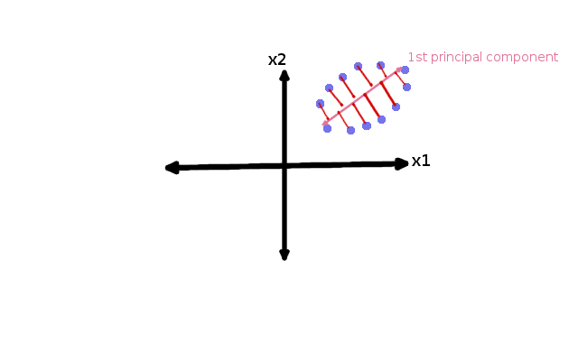

## 1D data after PCA

> - We lost ~25% of the variation, but we
> - halved the number of dimensions,
> - which incorporates most of the information from the original x1 and x2.

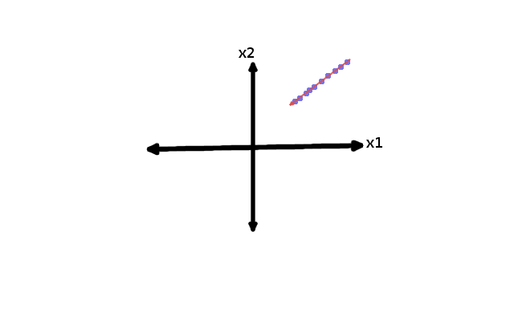

## How many principal components do you need?

- Rule of thumb: Stop when you can explain 90% of the variance (much depending on the goal),
- Typical “80/20 rule”: 80% explained by 20%
  - Most of the variance (interesting part of data) will be explained by a very small number of principal components.

## Normalise your data before PCA!

- PCA seeks to identify the principal components with the  highest *variance*,
  - If the data are not normalized, large values will have large variances (in absolute terms)
  - It will dominate the first PC's

# In mathematical terms...

## Eigenvectors

Mathematically, the principal components are the eigenvectors of the **covariance matrix** of the original dataset.

The principal components (**eigenvectors) correspond to the direction** (in  the original n-dimensional space) with the greatest variance in the  data.

## Covariance

> - Covariance
>   - Calculated pairwise between each variable,
>   - to summarise how much the change in X, predicts the change in Y
>   - is the mathematical way to find the eigenvectors.
> - The covariance matrix is just a matrix of pairwise covariances (think of the correlation matrix from the heatmap exercise).

## Covariance formula

Square expanded in variance:

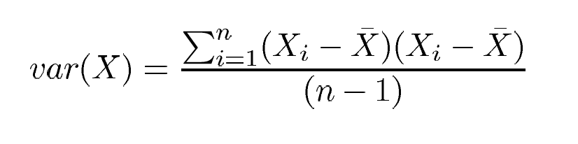{width=400px}

... is very similar to covariance:

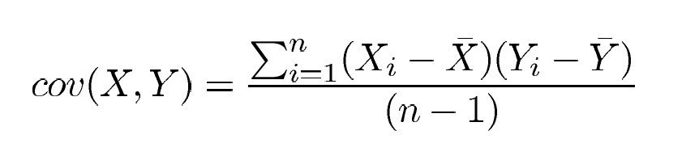{width=400px}

## Eigenvalues

> - **Each eigenvector has a corresponding eigenvalue**.
> - An eigenvalue is a number that indicates how much variance  there is in the data along that eigenvector (or principal component).
>   - A principal component with a small eigenvalue does not do a good job...
>   - If a principal component had an eigenvalue of zero,  then it would mean that it explained none of the variance in the data.
>   - For dimensionality reduction: discard any principal components withnear-zero eigenvalues.

## You can use the “PCA” idea for classificaiton

**Linear Discriminant Analysis (LDA)** aims to find the directions that **maximize the separation** (or discrimination) between different classes, which can be useful in pattern classification problem (PCA  "ignores" class labels).

**In other words, **

- PCA projects the entire dataset onto a different feature (sub)space explain the highest variance, while

- LDA tries to determine a suitable feature (sub)space in order to distinguish between patterns that belong  to different classes.

## Comparison of PCA and LDA

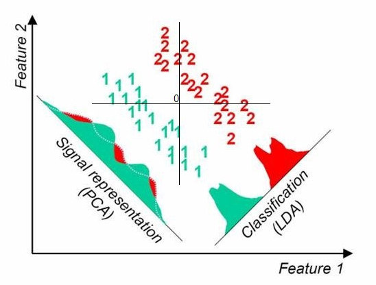

## Independent Component Analysis (ICA) to decompose signals that map to the same dimension

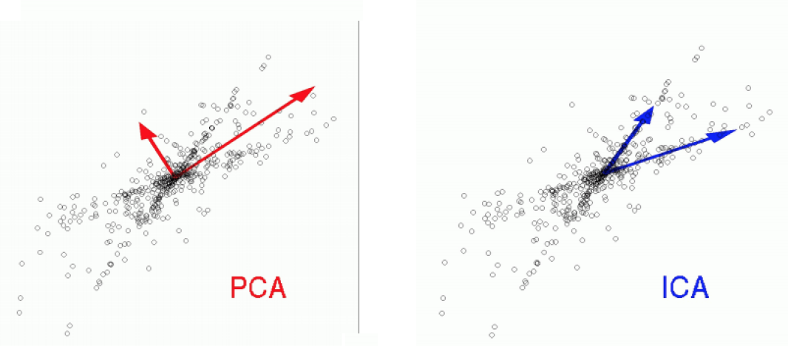{width=600px}

- Does not components are not orthogonal.
- Used for “demixing”: Find the 2 original signals that resulted in the observed variable.
-  *In layman terms PCA helps to compress data and ICA helps to separate data.*

## Multidimensional Scaling is a broader term with overlap to PCA

- Multidimensional Scaling (MDS) is a dimension-reduction technique designed to project high dimensional data down to 2 dimensions while  preserving relative distances between observations.
- It is most useful when the observations are significant and relatively small (basically to the limits of scatter plots).

## MDS vs PCA

You can define the distance metric however you want, and **MDS with euclidean distance is equivalent to extracting two principal components from a PCA analysis**. In general, other distance metrics can be used.

[Edited from: umich.edu/~jerrick](http://dept.stat.lsa.umich.edu/~jerrick/courses/stat701/notes/mds.html#content)

## Resources

1. [Tutorial from umontreal](www.iro.umontreal.ca/~pift6080/H09/documents/papers/pca_tutorial.pdf)
2. [towardsdatascience.com](https://towardsdatascience.com/a-one-stop-shop-for-principal-component-analysis-5582fb7e0a9c)

