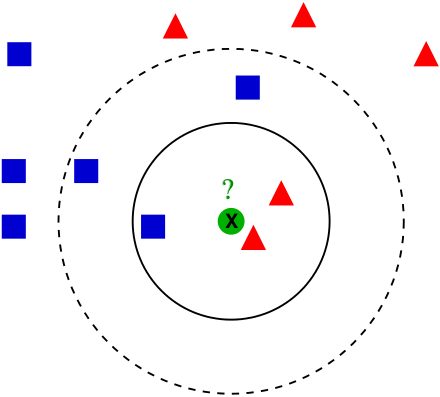
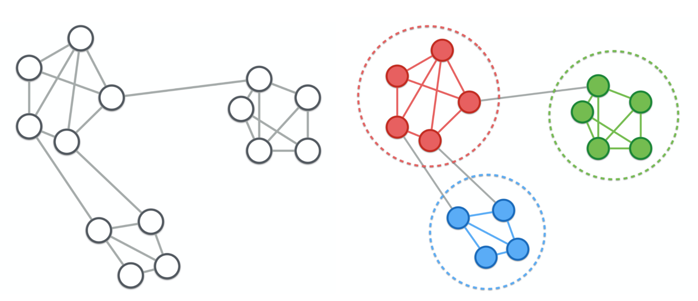

## About clustering

- Identify groups of similar cells (measurement objects)
- ***What clustering methods did we learn about?***
- ***Could you explain the main ideas please?***

## Hierarchical and K-means clustering

→ **See the [clustering slides](https://docs.google.com/presentation/d/1RgvkdJNhqxHRmAhUpyEMm8rjrCqvdqlNHqBudWjht7E/edit?usp=sharing)** from the [course materials / lectures ](http://goo.gl/vMUXAk) of the [EDA course](https://vertesy.github.io/Exploratory-data-analysis-in-R/).

## Clustering in Seurat is a bit more complicated

Seurat clusters cells:

- Instead of genes, based on *principal components*:
  - each PC  represents a ‘metagene’,
    - which combines information from multiple correlated genes.
- [`Seurat`](https://github.com/satijalab/seurat) clustering is based on a _community detection_ approach similar to `SNN-Cliq`
  - Algorithm: **graph-based clustering**

## Graph-based clustering is based on K-nearest neighbours (KNN) classification

#### KNN classification

- Supervised approach (we have labels: `red`, `blue`)
- Is `X`  `red` or `blue`?

> Wikipedia

---
### Graph-based clustering

Think of finding groups of friends among the people in UG!

## Steps of graph-based clustering

  - Embed cells in a graph structure
      - This graph is derived from KNN graph
          - calculated on the euclidean distance of cells in PCA space
          - refine the edge weights between any two cells based on the overlap in their local neighborhoods
  - Find “cliques”  or “communities” link in the graph

