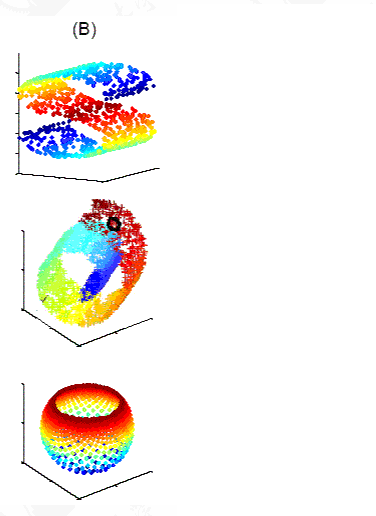
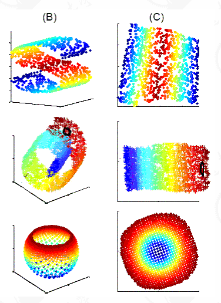
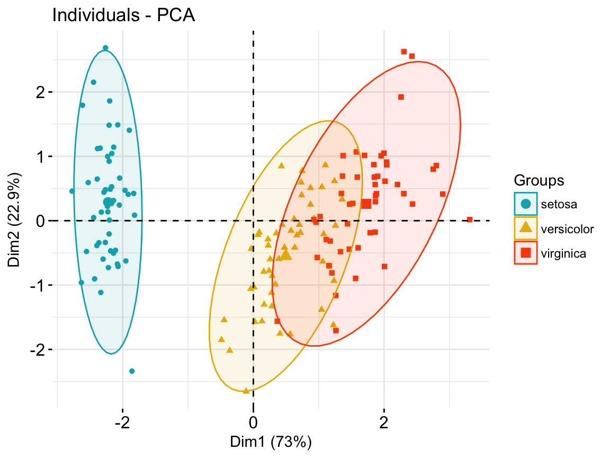

## When do we use non-linear dimensional reduction?

> - We learnt about PCA, why don’t we just use that?
> - In some cases data has some non-linear structure which linear methods cannot unfold.
>   - i.e.: There are problems too hard to solve linearly

## How would you reduce the dimensionality of this object?

{width=400px}

> - This pine apple skin has a folded 2D surface
>   - Surfaces in multiple dimensions are called manifolds (a mathematician would kill me for this).
>   - **Manifold learning**  is way (and name) of reducing dimensions.

## How could you simplify these 3 dimensional data?

[Andy's blog](https://www.google.nl/url?sa=i&rct=j&q=&esrc=s&source=images&cd=&cad=rja&uact=8&ved=2ahUKEwjmsoamx9HcAhVGyKQKHfUbCccQjB16BAgBEAQ&url=http%3A%2F%2Fjntsai.blogspot.com%2F2015%2F04%2Fammai-nonlinear-dimensionality.html&psig=AOvVaw1p4BG6OQmtMBwFP6TeKqsR&ust=1533408686025399)

## Simplify the data by unfolding the higher dimensional surfacex

## Crowding problem in PCA leads to overlapping points / inseparable clusters

{width=600px}

## Why is there a crowding problem of dimensionality reduction?

> - The distribution of the pairwise distances is very different between a high-dimensional and a low-dimensional space.
> - *In a 2D space, how many point you can put equidistantly?*
> - You can only put n+1 points equidistant.  (n =dimensions )

## Linearly simplifying data with non-linear structures can also leads to the crowding problem

{width=400px}

## How to map a 1000 dimensions?

> - Now you have 100 cells that are equidistant in 1000 dimensions - how do you map this out?
>    - Shortly, you cannot: known as the crowding problem
>    - But you can try to approximate it.
>      - Spring example: each data point is pulled by a spring proportional to its distance in 100D

# tSNE: t distribution-Stochastic neighborhood embedding

## An intuitive tSNE explanation

→ See tSNE slides from StatQuest

## How does t-SNE really work?

You have 1000 dimensional data set:

- impossible to visualize & get a sense of it
  - We have to convert that 1000D data set to something that we can visualize & play  around.

## Steps of tSNE

See the [Statquest presentation!](https://statquest.org/2017/09/18/statquest-t-sne-clearly-explained/)

## Conversion to similarity matrix

>- Measures similarity for every pair of data points (cell).
>- Similar data points will have more value of similarity and the different data points will have less value.
>- You convert from
>     - `cell * gene (feature)` dimensions to
>     - `cell * cell` dimensioned similarity matrix.
>          - ***Remember the sample correlation heatmap? That was a similarity matrix between worms.***
>     - You have now a similarity matrix `S1`
>     - (You already left the original highest dimensional space.)

## Stochastic Neighbourhood Embedding

>- Convert this similarity distance to probability (joint probability) according to the normal distribution.
>- Now, t-SNE arranges all of the data points randomly on an even lower dimensional space (say 2D) .
>   - **Stochastic Neighbourhood Embedding**
>   - Put cells close to each other based on their similarity (~ probability) in high-D
>        - Because its sampling from a probability distribution, its stochastic.
>   - Now you have distances in 2D space.

## Finding the optimal 2D representation

>- Move points around (optimise their location) on their similarity (~ probability) in high-D
>- Repeat until **convergence**
>    - convergence =  when you cannot get better

## Compare Similarity in high-D and similarity in (2)D

>- Now we also have the similarity matrix for the data points in lower dimension: `S2`
>- t-SNE then compares matrix `S1` and `S2` &
>- tries to make the  difference smaller by (some  complex mathematics.)
  > - ***Remember optimization?*** *There is actually a gradient descent optimisation inside.*
>- At the end we will have lower dimensional data points which tries to capture even complex relationships at which PCA fails.

## Why t-distribution?

The distribution of the pairwise distances is very different between a high-dimensional and a low-dimensional space.

- Think of the triangle example in the PCA presentation

## Sources:

[Quora](https://www.quora.com/How-does-t-SNE-work-in-simple-words)

[analyticsvidhya.com](https://www.analyticsvidhya.com/blog/2017/01/t-sne-implementation-r-python/)

[blog.paperspace.com](https://blog.paperspace.com/dimension-reduction-with-t-sne/)

[statquest.org (recommended)](https://statquest.org/) or [video](https://www.youtube.com/watch?v=NEaUSP4YerM)

